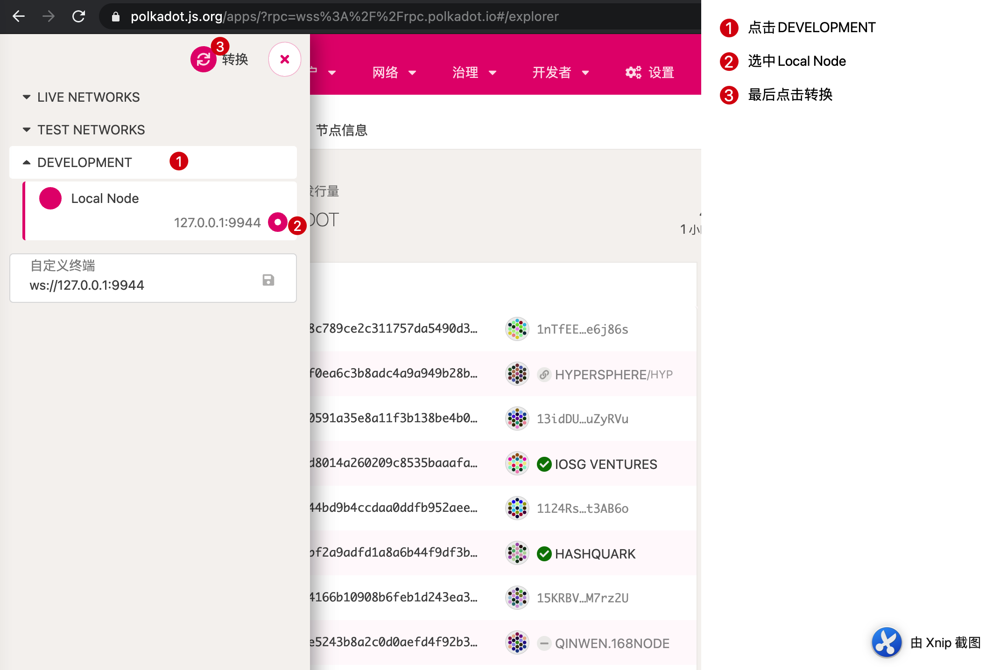

## 1.概述


波卡的可扩展性很大，整体模块化。


波卡也是基于substrate开发的：


 之前runtime中的模块被称为substrate runtime module library（SRML），现在统称为pallet。目前substrate支持的pallet已经有40个左右了。


runtime中的组件拿来即用，如果要自定义组件后面会讲到要遵从一个范式。


如何做到永不分叉：有交易来的时候，节点判断本地的native runtime和链上的wasm runtime版本是否一致，如果一致执行native runtime（因为速度快），如果不一致执行链上runtime。这是为了保证账本的一致性。即，如果节点不升级，那么将强制执行链上的最新版本。

runtime如何升级？


开发者在开发自己的私链时，可以通过sudo模块一键升级自定义的模块。在公网上可以通过democracy模块让全网公投，来进行升级。


substrate中有一种功能称为链下工作机：off-chain workers，所以其可以与企业系统无缝集成。


将密集计算的部分放到链下。比如：将写mysql这个动作记录在链上，而真正的读写是链下完成。区块链不保证是否真的向mysql写入了预期的数据，而只记录应该写入mysql的这个动作。这样就不会耽误出块共识了。所以说substrate也适用于联盟链：


学习substrate的途径：


```shell
git clone https://github.com/paritytech/substrate.git

cd substrate

cargo build --release
```

注：使用最新的rust

在编译前应做好的准备工作：参见https://zhuanlan.zhihu.com/p/48976310

升级rust：

```shell
# 更新工具链
rustup self update
# 安装nightly版本
rustup install nightly
# 切换rustc到nightly版本
rustup default nightly
# 安装编译目标(target) ---- wasm32-unknown-unknown
rustup target add wasm32-unknown-unknown
# 用cargo安装包管理器 ---- wasm-pack
```

当使用`cargo build --release`进行编译后，可执行文件会在当前rust项目的target/release路径下。

注：当cargo.lock改变之后，会直接影响到`cargo build --release`的过程（比如需要编译的项变多）。当编译一次失败之后，记得revert cargo.lock文件到初始状态。然后再重新编译。

回撤cargo.lock变化：`git checkout .`

### 1.1 运行单节点：以dev模式启动

```shell
./target/release/substrate --dev
```


这样每次启动，都会从之前的区块状态继续运行。

如何删除之前的区块数据，重新从0高度启动呢？

```shell
./target/release/substrate purge-chain --dev
```


只有再执行`./target/release/substrate --dev`就是重新起了一条私链。

#### 1.1.1 相关前端

启动节点后，浏览器访问：polkadot.js.org


进入后默认显示是波卡主网的：


切换至本地node：



之后前端会显示私链网络的信息：


点击账户，可以看到该网络内的genesis设置的账户信息：


可以在界面中相互转账：


转账成功后，再页面右上角会有：


最终在前端的最新事件里就可以看到之前的那笔转账：


### 1.2 本地起多节点

首先以alice身份启动链并指定该链是什么链——local。其数据会存放在 ~/tmp/alice：

```shell
./target/release/substrate --alice --chain local --base-path ~/tmp/alice

# 删除alice节点数据
rm -rf ~/tmp/alice
```


由于此时网络内只有alice，所以无法正常出块，网络一直hang在高度0。

新起终端并启动bob节点连入网络：

```shell
./target/release/substrate --bob --chain local --base-path ~/tmp/bob
```

此时alice的终端中会提示：


