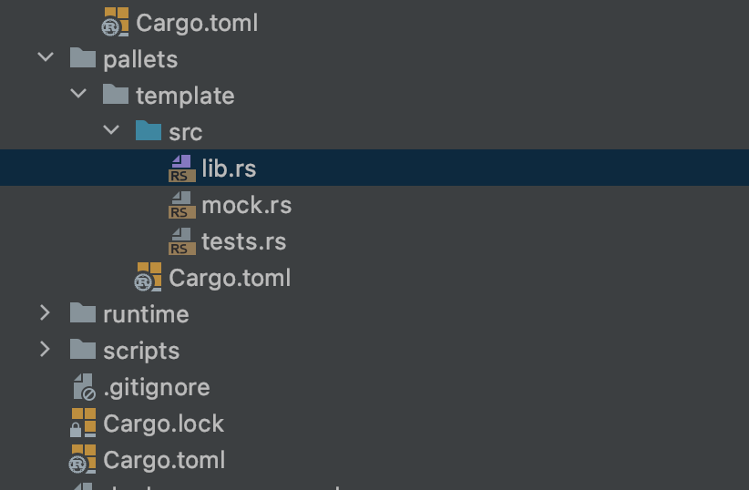

## 2.node template

substrate node template是一个最小的substrate可用的demo，可用于substrate技术入门。


- Trait是trait名；
- decl_storage：声明runtime存储的地方；
- decl_event：声明事件的地方；
- decl_error：声明错误的地方；
- decl_module：声明用户可以调用的runtime的一些方法。
- `impl<T:Trait>Module<T>`是定义一些用户不能调用，但是会给当前的pallet提供的工具方法或其他pallet可以调用当前pallet的一些方法。


这部分是很抽象的。每个pallet下面都会声明一个Trait，冒号后面的`system::Trait`表示继承。system是substrate中最基础的一个pallet，自定义pallet时候几乎都会用到。

在Trait中会定义许多**关联类型**(抽象的)，如上图中的Origin/Call/Index等。定义关联类型是为了和其他pallet产生交互。我们在type BlockNumber的冒号后面加入一些trait的约束（可加、可减），在封装整个runtime的时候可以给这个BlockNumber赋予实际类型（比如u32,u64,u128等），只要这些类型满足BlockNumber的约束即可。

这么做是高度某块化的体现，假如我写的模块之前是用usdt支付，而我想改成用加密猫来支付，直接在封装runtime的时候修改即可，而不需要修改pallet下面的一行代码。


除了TemplateModule换成自己定义的模块名，其他地方几乎不需要修改。

Something和SomeMap是我们自定义的类型，这里的Something是`Option<u32>`，SomeMap是一个key为AccountId，值为u32的map。如果我们调用someting这个方法（fn）就可以得到对应的Something对象，同理some_map（fn）方法。


这里我们只需要修改`pub fn do_something(origin, something u32)-> Result`这个地方即可。在do_something函数中最后会执行deposit_event方法，表示如果都执行没有问题后将抛出一个event事件。


声明事件。

前面这些都是宏，并非实际的定义代码。


这里不再是宏，而是实实在在的函数定义。该地方定义的方法不是给用户调用的，而是给该模块或者其他模块来调用的。fn前加了pub表示其他模块可以调用，而不加pub则表示是该模块的私有函数，只能本模块内调用。

获取substrate node template：

```shell
git clone http://github.com/substrateCourse/substrate-node-template.git
```

该工程中有四个文件夹：


**node**

- chain_spec.rs：一些创世的配置；
- cli.rs：命令行相关；
- service.rs：封装了各种call层面的模块和服务组件，即将substrate的底层组件都封装在一起；

**runtime**

substrate的分层结构是很明显的：下面是call层，再下面是runtime层。runtime层即链上逻辑层。

runtime封装了所有的pallets。


**pallets**

放置了很多具体的模块，常用的区块链转账、治理、升级，具体的逻辑都包含在pallets里面。未来大家最常用到的也将是这个地方。

由于当前工程是node-template，所以pallets下只有template这一个模块：




总体结构和前面提到的“模块定义概览”是一致的。

上述src/lib.rs文件一共只有103行，但是如果将这里面定义的宏（宏中的语法并不是标准rust语法）全部展开的话（展开成标准rust语句）总共有975行。这也是为什么substrate很好用的原因，因为抽象出了四个宏`decl_storage!/decl_event!/decl_error!/decl_module!`，然后用写智能合约的难度来构建自己的区块链。

但是这种宏的方式也有一些缺点，即bug将包含在宏中，debug的时候会有一些难度。

在runtime中可以看见：

```rust
impl pallet_transaction_payment::Trait for Runtime {
  // 在该Runtime中使用的Currency使用的是Balances。假如你要双代币的区块链，可以在这个地方随时替换。
	type Currency = Balances;
	type OnTransactionPayment = ();
	type TransactionByteFee = TransactionByteFee;
	type WeightToFee = IdentityFee<Balance>;
	type FeeMultiplierUpdate = ();
}

impl pallet_sudo::Trait for Runtime {
  // 会在这个地方赋予Event具体的类型
	type Event = Event;
	type Call = Call;
}

/// Configure the template pallet in pallets/template.
impl pallet_template::Trait for Runtime {
	type Event = Event;
}
```

在`construct_runtime!`宏中，将自定义的pallet添加进Runtime中。


编译前准备工作：

使用官方提供的安装工具链，否则编译会报错：


具体指令：

```shell
RUST_UPDATE_ROOT="https//static.rust-lang.org/rustup/dist"
# 清空时，使用官方源
RUST_DIST_SERVER=   
rustup install nightly-2020-10-05
# 切换默认版本
rustup default nightly-2020-10-05
rustup target add wasm32-unknown-unknown --toolchain nightly-2020-10-05
# 编译(cd到工程的根路径下)
cargo build --release
```

编译成功后，启动local单节点链：

```shell
./target/release/node-template --dev
```


打开polkadot.js，点击开发者->链状态


可以查看我们在runtime中加入的各个模块：


这时点击开发者->交易，用alice来发送一笔交易：


进而选择doSomething：


输入金额：


点击提交交易。

执行成功后，再回到链状态：


之后退到浏览，可以看到链上的最新事件：


这样，链下的世界就可以通过event来获取链上最新的状态修改。

一些帮助链接：

