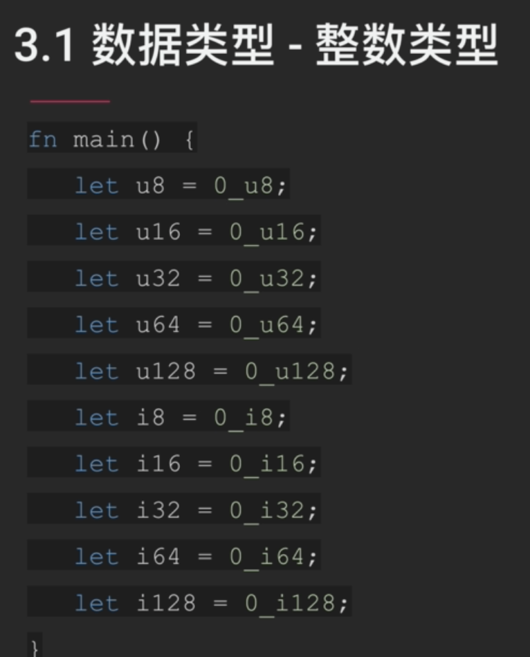
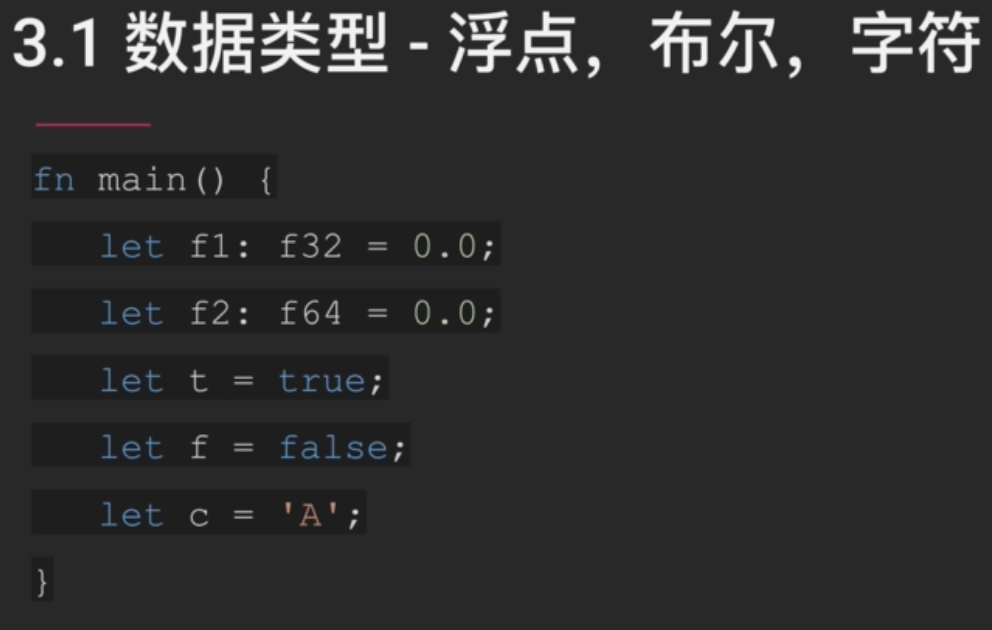
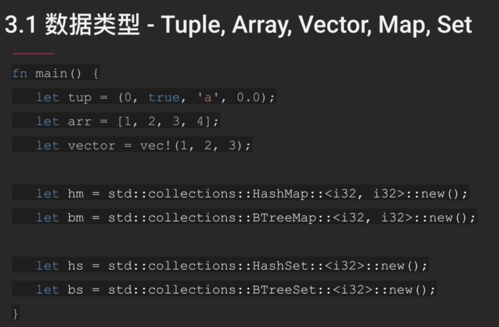
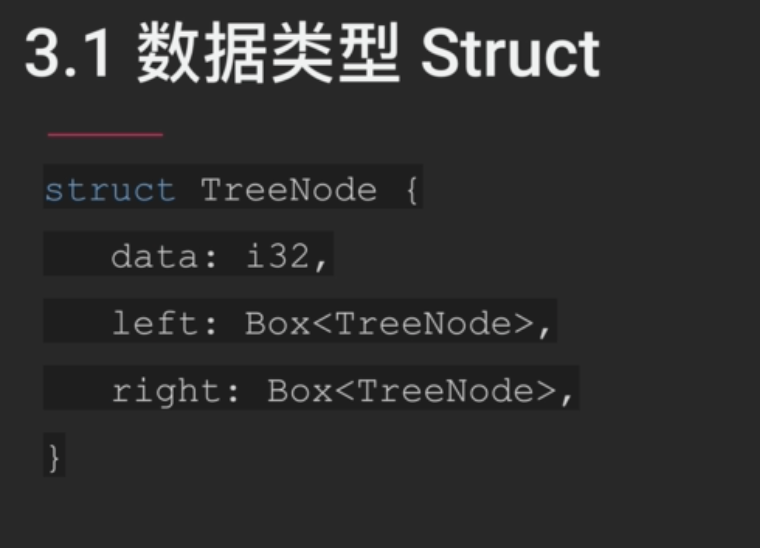
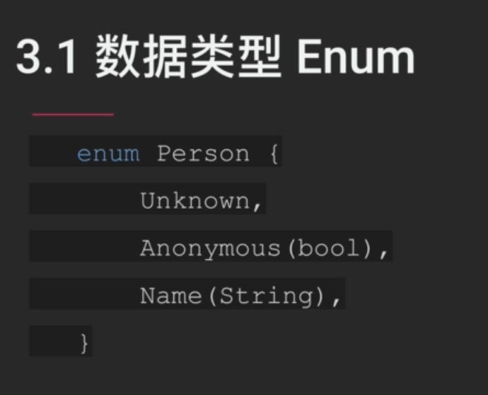
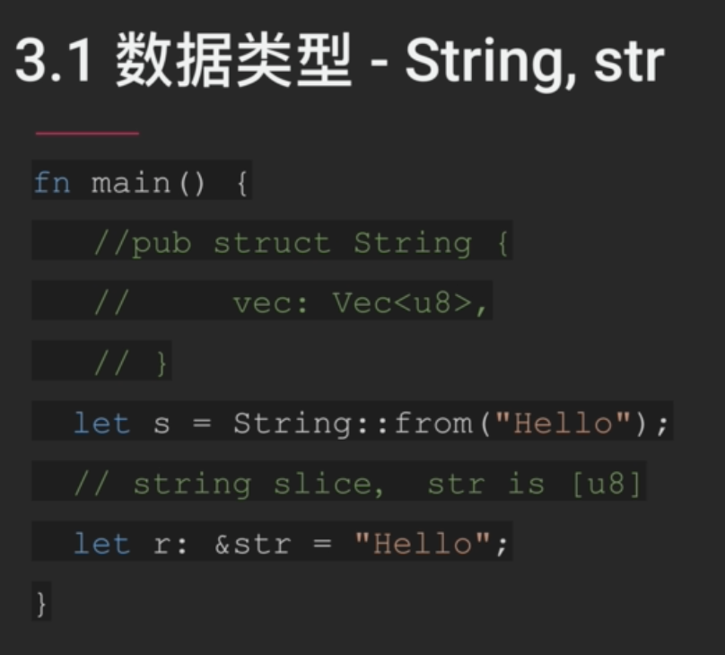
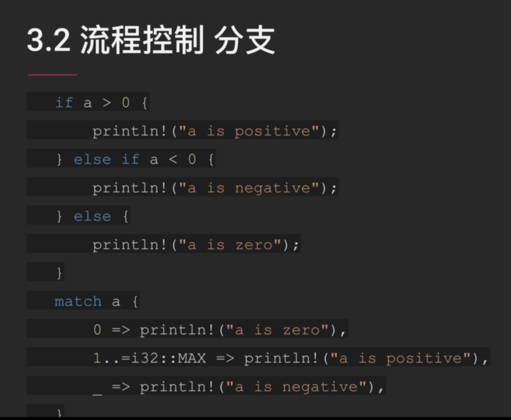
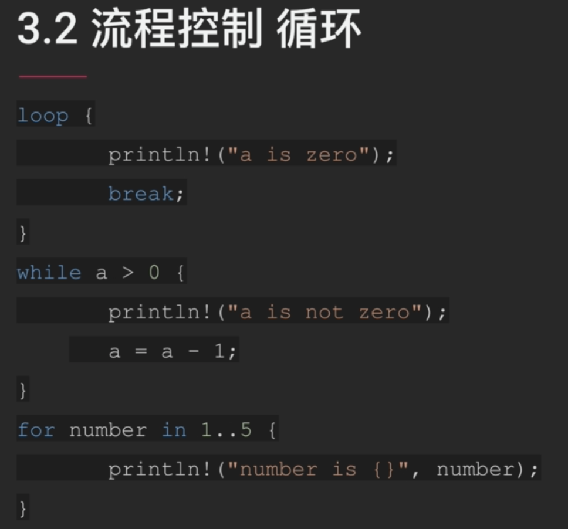
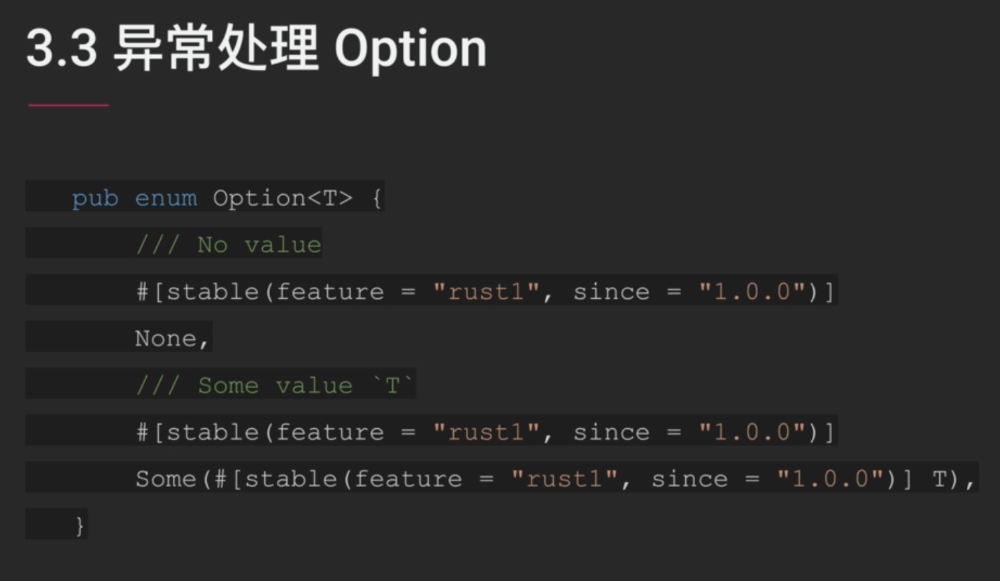

## 3.Rust入门

rust中没有“0等价于false，非零值等于true”这个规则。

rust中一个字符为unicode编码，占4个字节。

tuple中数据类型可以不相同，但是array和vector中不行。vector是动态数组。

rust中对于map有两种实现：1.HashMap；2.BTreeMap。如果你希望key值可以做比较，那么选择BTreeMap，因为其底层是用一个树形结构来实现的。它也可以让你将其内部的元素以一个有序顺序输出。

对比与HashMap，BTreeMap在插入元素时候效率低一些。

map中存放的是键值对，set中存放的只有值。

由于rust语言要求任何数据结构在定义时大小是可知的，所以left和right成员使用Box来封装TreeNode。

其他语言的枚举型往往都是将符号映射成0~N的整数值。而rust中的枚举，其中的成员取值是有类型的。上图中的Person枚举类可以存在三种状态：1.未知；2.是否匿名；3.可以准确地用名字来描述。所以，你可以从这三个角度中任选一个来使用Person枚举。这个有点像c++里的union。

String和str在rust中非常容易混淆。String的定义中包含了一个u8的vector。所以String是实际维护着一段数据的存储，是一个owner。而str并不是这样，它通常被称为数据切片，只是对数据的引用。

由于str指向的数据长度不确定，所以**不能直接实例化str对象**的。通常我们需要使用str的引用来实例化一个变量。在后面学到ownership的时候会对此有更深的理解。

if ... else if ... else的流程控制，可以用模式匹配等效完成，即match包含的语句块。

rust提供三种关键字来实现循环。死循环用loop。

注：1..5表示[1,5)

空指针往往会引起大量的bug，因为许多空指针是在运行过程中出现的，而编译器是无法在编译阶段获知到空指针的存在。

Option是一个enum，其有两个状态：1.None（即空）；2.Some。

Some中会包有一个泛型T，T为真正值的类型。这样在需要期望值T的时候，都需要通过模式匹配的方式从Option中将T取出，一旦该值为None（空），就会被程序捕获。