## 4. node template代码导读

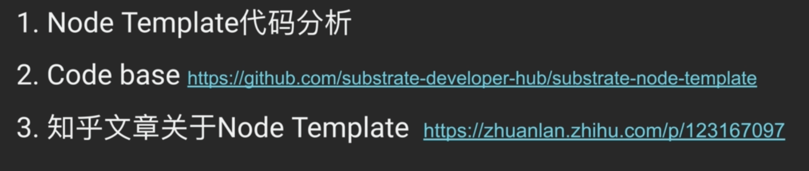

先看一下Cargo.toml的结构：

```toml
[profile.release]
panic = 'unwind'

[workspace]
members = [
    'node',
    'pallets/template',
    'runtime',
]
```

对应的Cargo.lock里面有各种依赖package的信息：

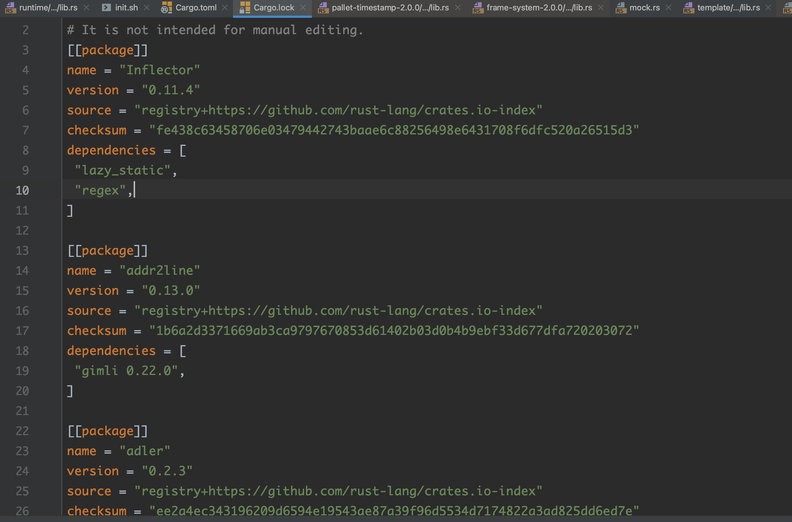

看一下node路径下的Cargo.toml文件内容：

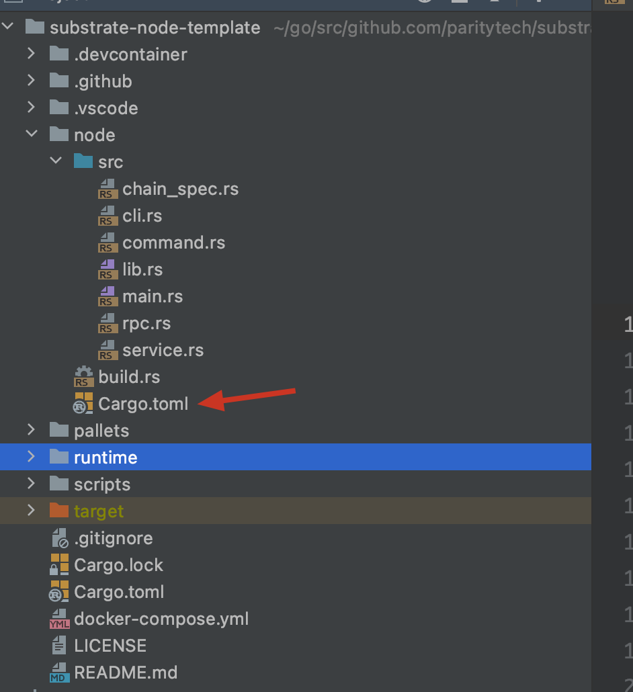

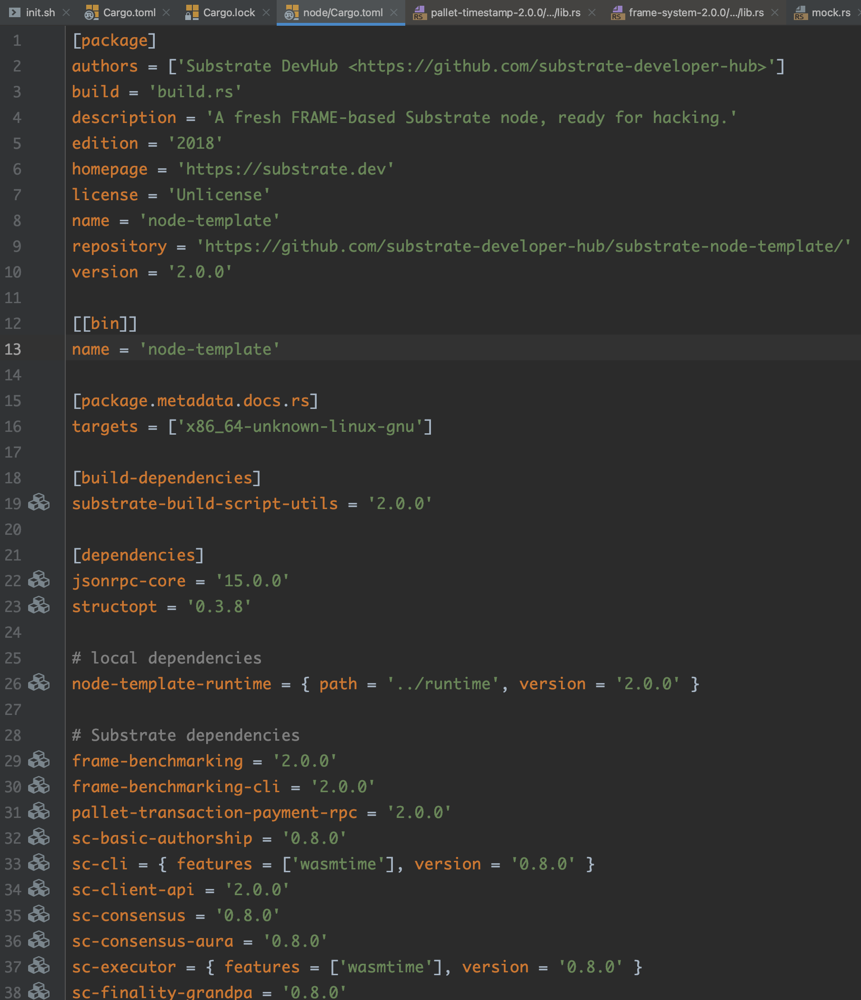

有[[bin]]说明这个node一定可以编译成一个可执行文件，即拥有main.rs。dependencies中会给出第三方依赖包的名字及其对应版本号。这些包会在crates.io中查到定义：

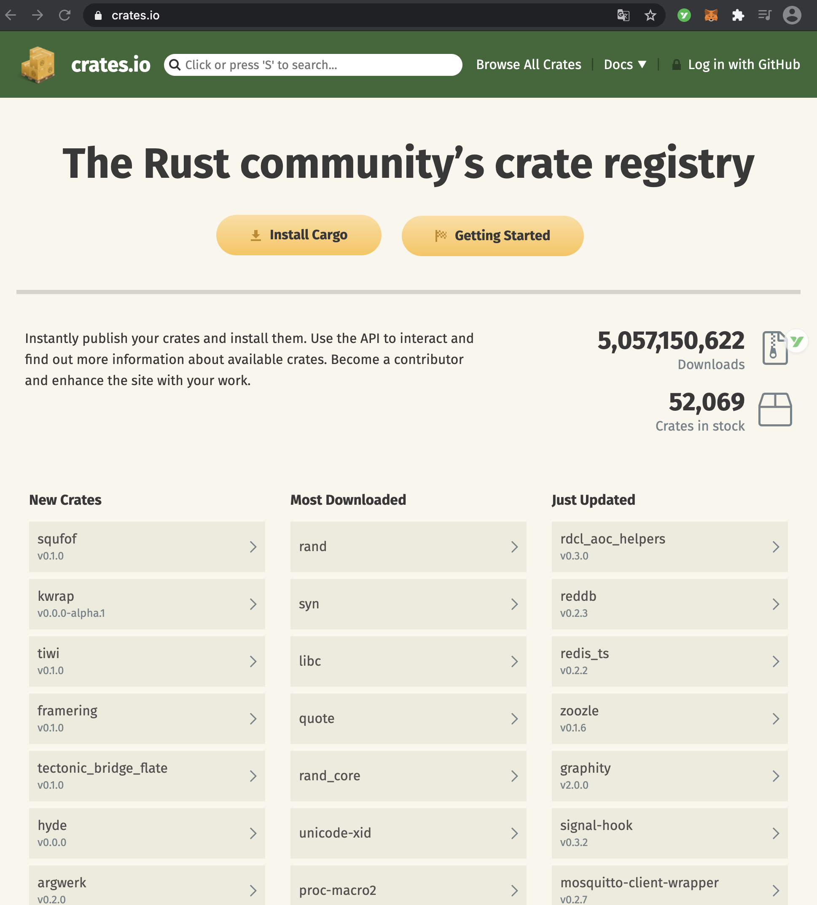

还有一些依赖是依赖本地的package，不需要从网络上同步：

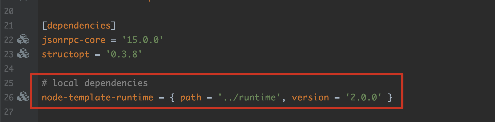

main函数很简单：

```rust
fn main() -> sc_cli::Result<()> {
	command::run()
}
```

node/command.rs文件：

```rust
/// Parse and run command line arguments
pub fn run() -> sc_cli::Result<()> {
	let cli = Cli::from_args();

	match &cli.subcommand {
		Some(Subcommand::BuildSpec(cmd)) => {
			let runner = cli.create_runner(cmd)?;
			runner.sync_run(|config| cmd.run(config.chain_spec, config.network))
		},
		Some(Subcommand::CheckBlock(cmd)) => {
			let runner = cli.create_runner(cmd)?;
			runner.async_run(|config| {
				let PartialComponents { client, task_manager, import_queue, ..}
					= service::new_partial(&config)?;
				Ok((cmd.run(client, import_queue), task_manager))
			})
		},
		Some(Subcommand::ExportBlocks(cmd)) => {
			let runner = cli.create_runner(cmd)?;
			runner.async_run(|config| {
				let PartialComponents { client, task_manager, ..}
					= service::new_partial(&config)?;
				Ok((cmd.run(client, config.database), task_manager))
			})
		},
		Some(Subcommand::ExportState(cmd)) => {
			let runner = cli.create_runner(cmd)?;
			runner.async_run(|config| {
				let PartialComponents { client, task_manager, ..}
					= service::new_partial(&config)?;
				Ok((cmd.run(client, config.chain_spec), task_manager))
			})
		},
		Some(Subcommand::ImportBlocks(cmd)) => {
			let runner = cli.create_runner(cmd)?;
			runner.async_run(|config| {
				let PartialComponents { client, task_manager, import_queue, ..}
					= service::new_partial(&config)?;
				Ok((cmd.run(client, import_queue), task_manager))
			})
		},
		Some(Subcommand::PurgeChain(cmd)) => {
			let runner = cli.create_runner(cmd)?;
			runner.sync_run(|config| cmd.run(config.database))
		},
		Some(Subcommand::Revert(cmd)) => {
			let runner = cli.create_runner(cmd)?;
			runner.async_run(|config| {
				let PartialComponents { client, task_manager, backend, ..}
					= service::new_partial(&config)?;
				Ok((cmd.run(client, backend), task_manager))
			})
		},
		Some(Subcommand::Benchmark(cmd)) => {
			if cfg!(feature = "runtime-benchmarks") {
				let runner = cli.create_runner(cmd)?;

				runner.sync_run(|config| cmd.run::<Block, service::Executor>(config))
			} else {
				Err("Benchmarking wasn't enabled when building the node. \
				You can enable it with `--features runtime-benchmarks`.".into())
			}
		},
		None => {
			let runner = cli.create_runner(&cli.run)?;
			runner.run_node_until_exit(|config| match config.role {
				Role::Light => service::new_light(config),
				_ => service::new_full(config),
			})
		}
	}
}
```

定义了一些子命令，即node-template xxx的可选子命令：`./target/release/node-template -h `

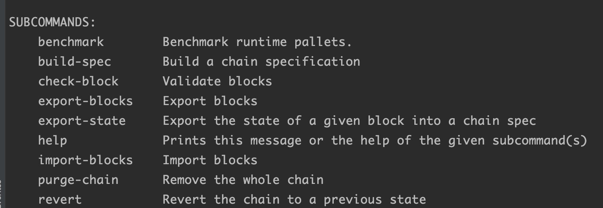

大多数的逻辑代码都在node/service.rs下面。他定义了node-template启动的时候需要初始化的内容：

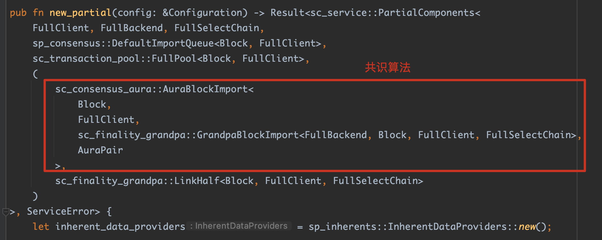

finality_grandpa是敲定块的算法。

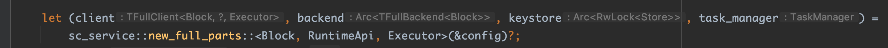

客户端、keystore和进程管理相关组件。service这个文件是将这些组件都拼装起来。

substrate中支持两种client：

1.full client：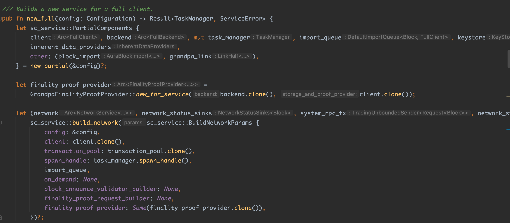

2.light client：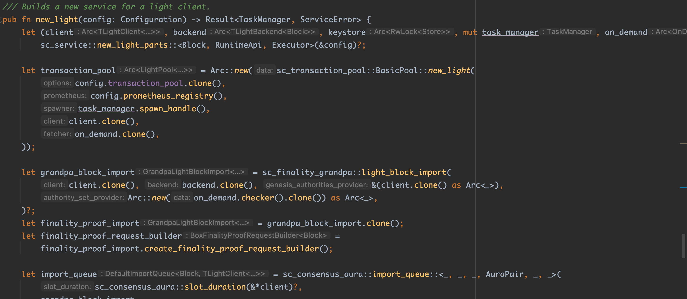

分别用两个函数封装起来，整个初始化的过程很清晰。

在full/light client中，都含有offchain workers的设置。offchain worker用于同区块链以外的系统建立联系。

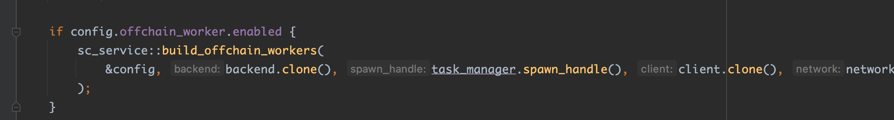