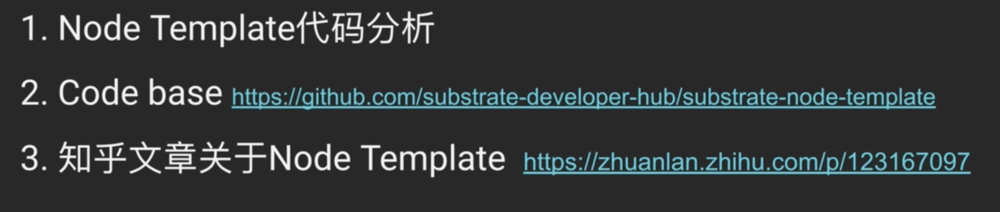
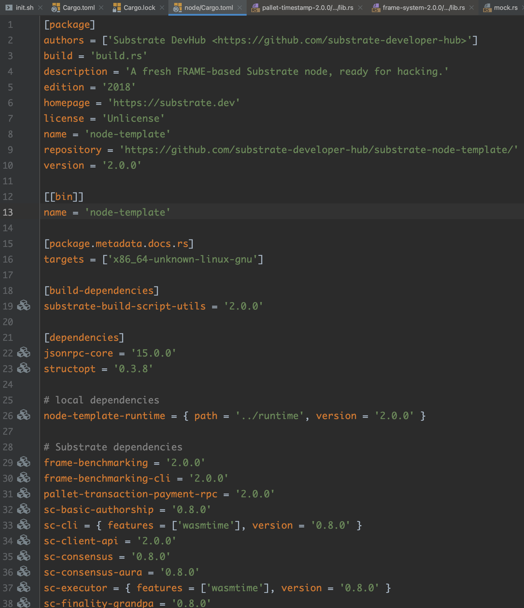
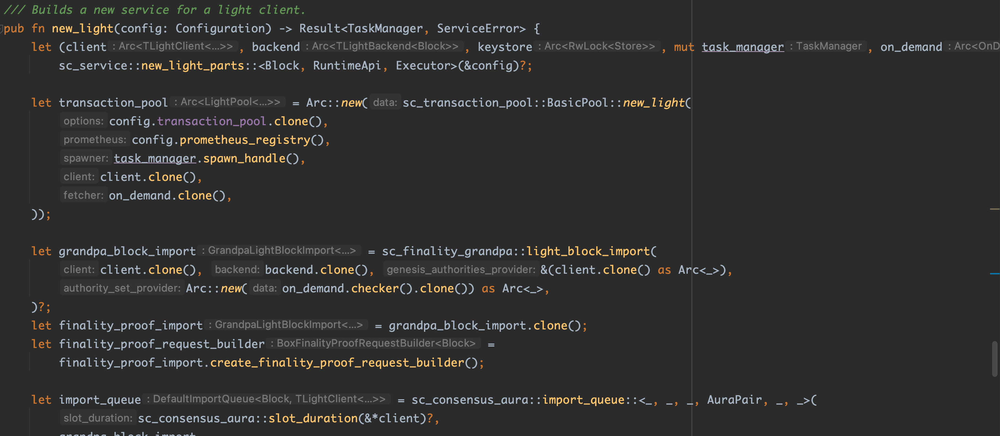

## 4. node template代码导读



先看一下Cargo.toml的结构：

```toml
[profile.release]
panic = 'unwind'

[workspace]
members = [
    'node',
    'pallets/template',
    'runtime',
]
```

对应的Cargo.lock里面有各种依赖package的信息：


看一下node路径下的Cargo.toml文件内容：




有[[bin]]说明这个node一定可以编译成一个可执行文件，即拥有main.rs。dependencies中会给出第三方依赖包的名字及其对应版本号。这些包会在crates.io中查到定义：


还有一些依赖是依赖本地的package，不需要从网络上同步：


main函数很简单：

```rust
fn main() -> sc_cli::Result<()> {
	command::run()
}
```

node/command.rs文件：

```rust
/// Parse and run command line arguments
pub fn run() -> sc_cli::Result<()> {
	let cli = Cli::from_args();

	match &cli.subcommand {
		Some(Subcommand::BuildSpec(cmd)) => {
			let runner = cli.create_runner(cmd)?;
			runner.sync_run(|config| cmd.run(config.chain_spec, config.network))
		},
		Some(Subcommand::CheckBlock(cmd)) => {
			let runner = cli.create_runner(cmd)?;
			runner.async_run(|config| {
				let PartialComponents { client, task_manager, import_queue, ..}
					= service::new_partial(&config)?;
				Ok((cmd.run(client, import_queue), task_manager))
			})
		},
		Some(Subcommand::ExportBlocks(cmd)) => {
			let runner = cli.create_runner(cmd)?;
			runner.async_run(|config| {
				let PartialComponents { client, task_manager, ..}
					= service::new_partial(&config)?;
				Ok((cmd.run(client, config.database), task_manager))
			})
		},
		Some(Subcommand::ExportState(cmd)) => {
			let runner = cli.create_runner(cmd)?;
			runner.async_run(|config| {
				let PartialComponents { client, task_manager, ..}
					= service::new_partial(&config)?;
				Ok((cmd.run(client, config.chain_spec), task_manager))
			})
		},
		Some(Subcommand::ImportBlocks(cmd)) => {
			let runner = cli.create_runner(cmd)?;
			runner.async_run(|config| {
				let PartialComponents { client, task_manager, import_queue, ..}
					= service::new_partial(&config)?;
				Ok((cmd.run(client, import_queue), task_manager))
			})
		},
		Some(Subcommand::PurgeChain(cmd)) => {
			let runner = cli.create_runner(cmd)?;
			runner.sync_run(|config| cmd.run(config.database))
		},
		Some(Subcommand::Revert(cmd)) => {
			let runner = cli.create_runner(cmd)?;
			runner.async_run(|config| {
				let PartialComponents { client, task_manager, backend, ..}
					= service::new_partial(&config)?;
				Ok((cmd.run(client, backend), task_manager))
			})
		},
		Some(Subcommand::Benchmark(cmd)) => {
			if cfg!(feature = "runtime-benchmarks") {
				let runner = cli.create_runner(cmd)?;

				runner.sync_run(|config| cmd.run::<Block, service::Executor>(config))
			} else {
				Err("Benchmarking wasn't enabled when building the node. \
				You can enable it with `--features runtime-benchmarks`.".into())
			}
		},
		None => {
			let runner = cli.create_runner(&cli.run)?;
			runner.run_node_until_exit(|config| match config.role {
				Role::Light => service::new_light(config),
				_ => service::new_full(config),
			})
		}
	}
}
```

定义了一些子命令，即node-template xxx的可选子命令：`./target/release/node-template -h `


大多数的逻辑代码都在node/service.rs下面。他定义了node-template启动的时候需要初始化的内容：


finality_grandpa是敲定块的算法。


客户端、keystore和进程管理相关组件。service这个文件是将这些组件都拼装起来。

substrate中支持两种client：

1.full client：

2.light client：

分别用两个函数封装起来，整个初始化的过程很清晰。

在full/light client中，都含有offchain workers的设置。offchain worker用于同区块链以外的系统建立联系。


**runtime的实现**

pallet的定义，初始化，类型绑定，比如：


可以看到BlcokNumber在实现上被绑定成了u32。

也只定了哈希函数——sp_core::H256。

RuntimeVersion的定义非常重要，在runtime升级的时候会比较spec_version和impl_version这些信息。


下面是pallet在runtime中的定义与绑定：

```rust
// frame_system是Runtime最需要实现的一个trait，其中包含了许多type的参数
impl frame_system::Trait for Runtime {
	/// The basic call filter to use in dispatchable.
	type BaseCallFilter = ();
	/// The identifier used to distinguish between accounts.
	type AccountId = AccountId;
	/// The aggregated dispatch type that is available for extrinsics.
	type Call = Call;
	/// The lookup mechanism to get account ID from whatever is passed in dispatchers.
	type Lookup = IdentityLookup<AccountId>;
	/// The index type for storing how many extrinsics an account has signed.
	type Index = Index;
	/// The index type for blocks.
	type BlockNumber = BlockNumber;
	/// The type for hashing blocks and tries.
	type Hash = Hash;
	/// The hashing algorithm used.
	type Hashing = BlakeTwo256;
	/// The header type.
	type Header = generic::Header<BlockNumber, BlakeTwo256>;
	/// The ubiquitous event type.
	type Event = Event;
	/// The ubiquitous origin type.
	type Origin = Origin;
	/// Maximum number of block number to block hash mappings to keep (oldest pruned first).
	type BlockHashCount = BlockHashCount;
	/// Maximum weight of each block.
	type MaximumBlockWeight = MaximumBlockWeight;
	/// The weight of database operations that the runtime can invoke.
	type DbWeight = RocksDbWeight;
	/// The weight of the overhead invoked on the block import process, independent of the
	/// extrinsics included in that block.
	type BlockExecutionWeight = BlockExecutionWeight;
	/// The base weight of any extrinsic processed by the runtime, independent of the
	/// logic of that extrinsic. (Signature verification, nonce increment, fee, etc...)
	type ExtrinsicBaseWeight = ExtrinsicBaseWeight;
	/// The maximum weight that a single extrinsic of `Normal` dispatch class can have,
	/// idependent of the logic of that extrinsics. (Roughly max block weight - average on
	/// initialize cost).
	type MaximumExtrinsicWeight = MaximumExtrinsicWeight;
	/// Maximum size of all encoded transactions (in bytes) that are allowed in one block.
	type MaximumBlockLength = MaximumBlockLength;
	/// Portion of the block weight that is available to all normal transactions.
	type AvailableBlockRatio = AvailableBlockRatio;
	/// Version of the runtime.
	type Version = Version;
	/// Converts a module to the index of the module in `construct_runtime!`.
	///
	/// This type is being generated by `construct_runtime!`.
	type PalletInfo = PalletInfo;
	/// What to do if a new account is created.
	type OnNewAccount = ();
	/// What to do if an account is fully reaped from the system.
	type OnKilledAccount = ();
	/// The data to be stored in an account.
	type AccountData = pallet_balances::AccountData<Balance>;
	/// Weight information for the extrinsics of this pallet.
	type SystemWeightInfo = ();
}
```

pallet_aura是用来决定出块者的算法：在正式环境中往往会选择Babe这种算法来决定出块者。（更安全）

```rust
// 基本类似于一种轮训的方式
impl pallet_aura::Trait for Runtime {
	type AuthorityId = AuraId;
}

// grandpa是一个敲定区块的算法
impl pallet_grandpa::Trait for Runtime {
	type Event = Event;
	type Call = Call;

	type KeyOwnerProofSystem = ();

	type KeyOwnerProof =
		<Self::KeyOwnerProofSystem as KeyOwnerProofSystem<(KeyTypeId, GrandpaId)>>::Proof;

	type KeyOwnerIdentification = <Self::KeyOwnerProofSystem as KeyOwnerProofSystem<(
		KeyTypeId,
		GrandpaId,
	)>>::IdentificationTuple;

	type HandleEquivocation = ();

	type WeightInfo = ();
}
```

pallet_template是我们DIY模块的定义：这里除了绑定event的操作以外，没有任何东西。

```rust
/// Configure the template pallet in pallets/template.
impl pallet_template::Trait for Runtime {
	type Event = Event;
}
```

**pallet的代码**

如果我们要开发一个自己的pallet时，可以选择substrate-node-template/pallets作为模板。

一般我们要为自己的pallet定义一个trait，该trait往往是要继承frame_system的Trait：


那些Event和BlockNumber都是定义在frame_system里面的。

定义在链上的数据存储：定义在这个宏里的变量，其数据都会在链上存储。

```rust
// The pallet's runtime storage items.
// https://substrate.dev/docs/en/knowledgebase/runtime/storage
decl_storage! {
	// A unique name is used to ensure that the pallet's storage items are isolated.
	// This name may be updated, but each pallet in the runtime must use a unique name.
	// ---------------------------------vvvvvvvvvvvvvv
	trait Store for Module<T: Trait> as TemplateModule {
		// Learn more about declaring storage items:
		// https://substrate.dev/docs/en/knowledgebase/runtime/storage#declaring-storage-items
    // Something是变量名，get是方法，并且能通过fn something取到Someting变量的值。该变量的类型是Option<u32>
		Something get(fn something): Option<u32>;
	}
}
```

定义链上可以抛出的event来通知用户：

```rust
// Pallets use events to inform users when important changes are made.
// https://substrate.dev/docs/en/knowledgebase/runtime/events
decl_event!(
	pub enum Event<T> where AccountId = <T as frame_system::Trait>::AccountId {
		/// Event documentation should end with an array that provides descriptive names for event
		/// parameters. [something, who]
    // event名字叫SomethingStored，并携有两个参数。
    // 第一个是u32，表示该Something的值，AccountId表示激发该event的tx是谁发的
		SomethingStored(u32, AccountId),
	}
);
```

定义链上可能返回的Error：各种可能返回的错误都需要定义在`decl_error!`这个宏中。

```rust
// Errors inform users that something went wrong.
decl_error! {
	pub enum Error for Module<T: Trait> {
		/// Error names should be descriptive.
		NoneValue,
		/// Errors should have helpful documentation associated with them.
    // 溢出报错
		StorageOverflow,
	}
}
```

定义用户可以调用的方法：这些方法都要定义在`decl_module!`宏中。

```rust
// Dispatchable functions allows users to interact with the pallet and invoke state changes.
// These functions materialize as "extrinsics", which are often compared to transactions.
// Dispatchable functions must be annotated with a weight and must return a DispatchResult.
decl_module! {
	pub struct Module<T: Trait> for enum Call where origin: T::Origin {
		// Errors must be initialized if they are used by the pallet.
		type Error = Error<T>;

		// Events must be initialized if they are used by the pallet.
		fn deposit_event() = default;

		/// An example dispatchable that takes a singles value as a parameter, writes the value to
		/// storage and emits an event. This function must be dispatched by a signed extrinsic.
		#[weight = 10_000 + T::DbWeight::get().writes(1)]
		pub fn do_something(origin, something: u32) -> dispatch::DispatchResult {
			// Check that the extrinsic was signed and get the signer.
			// This function will return an error if the extrinsic is not signed.
			// https://substrate.dev/docs/en/knowledgebase/runtime/origin
      // 第一步，验签
			let who = ensure_signed(origin)?;

			// Update storage.
      // 通过验签后，将传入的新值something更新到db中
			Something::put(something);

			// Emit an event.
      // 最后一步抛出event
			Self::deposit_event(RawEvent::SomethingStored(something, who));
			// Return a successful DispatchResult
			Ok(())
		}

		/// An example dispatchable that may throw a custom error.
		#[weight = 10_000 + T::DbWeight::get().reads_writes(1,1)]
		pub fn cause_error(origin) -> dispatch::DispatchResult {
      // 验签
			let _who = ensure_signed(origin)?;

			// 从store中读出存储的值
			match Something::get() {
        // 如果没有读到值，则返回Err(Error::<T>::NoneValue)?
				None => Err(Error::<T>::NoneValue)?,
				Some(old) => {
					// Increment the value read from storage; will error in the event of overflow.
          // 如果读到值，将该值加一。当该值加1后出现溢出时，会在此步骤直接返回Error::<T>::StorageOverflow
					let new = old.checked_add(1).ok_or(Error::<T>::StorageOverflow)?;
					// 如果没有溢出，则将加一后的值写入db
					Something::put(new);
					Ok(())
				},
			}
		}
	}
}
```

这里值定义了两个方法：1.do_something；2.cause_error

`pub fn do_something(origin, something: u32) -> dispatch::DispatchResult`第一个参数是由系统自动传入，第二个参数something是一个u32，函数将把这个新的值替换掉store中之前存储的值。

`pub fn cause_error(origin) -> dispatch::DispatchResult`并没有传入额外参数，而是在其中进行了一个原存储值自加1并存储的操作。