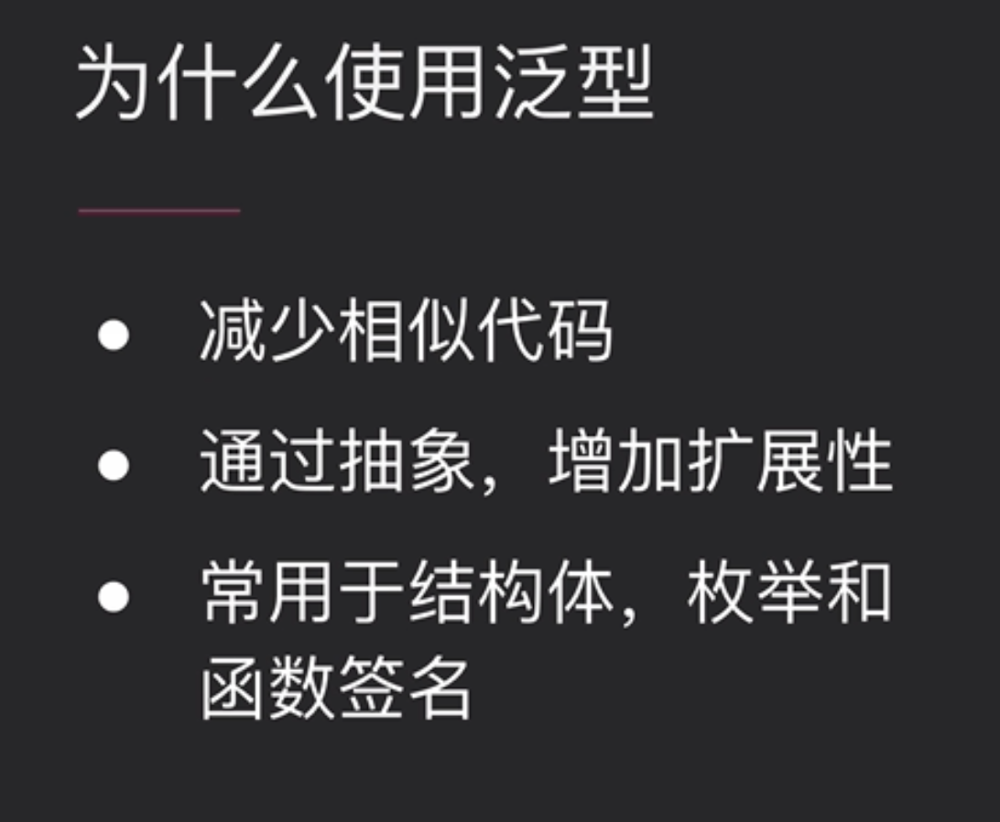

## 5.Rust进阶

### 枚举


枚举中不像c++那样只是整形的映射，反而可以包任意类型的数据。

注：枚举类可以定义自己的类方法，也可以实现trait

rust的在线编译器：play.rust-lang.org

```rust
enum TrafficLight {
    Red,
    Green,
    Yellow,
}

impl TrafficLight {
    fn time(&self) -> u8 {
        60
    }
}

fn main() {
    let i = TrafficLight::Red;
    println!("{:?}", i.time());	// 输出：60
}
```

注：此时没有使用模式匹配，编译器会报许多warning：


最常用的枚举：


Option的一些方法：

is_some：判断一个Option里面是否有值，如果是Some(x)则返回true，如果是None则返回false。

```rust
		let n: Option<u32> = None;				// 不能使用None，因为编译器无法根据None来反推出其类型Option携带的泛型
		println!("{}", Some(1).is_some());		// true
    println!("{}", n.is_some());					// false
    println!("{}", Some(1).is_none())			// false
```

map：会对Option中的值进行操作，如果是None的话什么都不做返回None。返回值为一个Option。

```rust
		println!("{}", Some(1).map(|x| x + 1).unwrap());					// 2
		println!("{:?}", n.map(|x| x + 1));												// None
```

map_or：与map类似，如果Option里面没有值，则可以返回一个给定的默认值。注：map_or返回的不是Option，而是Option里面包含的类型：

```rust
    println!("{}", Some(1).map_or(11, |x| x + 1));				// 2
    println!("{}", n.map_or(11, |x| x + 1));							// 11
```

unwrap：从一个Option中将数据解包出来。如果为None，则引发panic：

```rust
    println!("{}", Some(1024).unwrap());					// 1024
    println!("{}", n.unwrap());										// 引发panic
```


is_ok/is_err：依照是Ok还是Err返回布尔类型：

```rust
		let r: Result<u32, &str> = Ok(1024);
    let e: Result<u32, &str> = Err("default error");
    println!("{}", r.is_ok());			// true
    println!("{}", e.is_ok());			// false
    println!("{}", e.is_err());			// true
```

map：会对Result中的值进行操作，如果是Err的话什么都不做返回原Err。返回值为一个Result。

```rust
    println!("{}", r.map(|x| x + 1).unwrap());					// 1025
    println!("{}", e.map(|x| x + 1).unwrap_err());			// default error
		println!("{:?}", e.map(|x| x + 1));									// Err("default error")
```

map_or：如果Result中有值，则进行相关操作，否则返回给定的默认值。返回值为一个确定的类型，非Result：

```rust
    println!("{:?}", r.map_or(1024, |x| x + 1));			// 1025
    println!("{:?}", e.map_or(1024, |x| x + 1));			// 1024
```

unwrap：一个不安全的解包，如果Result为Err，则panic：

```rust
    println!("{}", r.unwrap());					// 1024
    println!("{}", e.unwrap());					// 引发panic
```


现代变成语言的一个强大的特性，可以将其想象成一个if...else..的加强版。适用于所有数据类型。

匹配必须完备，如果一个Option只匹配了Some，没有匹配None，将报错。

```rust
		let o = Some(1);
    match o {
        Some(s) => println!("{}", s),
      	// o是一个枚举，这里只匹配了Some，没有匹配None，将编译报错
    }

		// 编译成功版本
		let o = Some(1);
    match o {
        Some(s) => println!("{}", s),
        None => println!("None"),
    }
```

下划线`_`往往放在最后，匹配所有没有被匹配的值。所以谨慎使用`_`，容易出bug：

```rust
enum Season {
    Spring,
    Summer,
    Autumn,
    Winter,
}

		let s = Season::Autumn;
    match s {
        Season::Spring => println!("spring"),
        _ => println!("others"),
    }
```


模式匹配的一个语法糖：if let。当我们只关心一个分支时可以使用：


```rust
		let i = Some(1024u64);
    if let Some(a) = i {
        println!("{}", a);
    }
```

这些写代码可以更简洁，而不需要写冗长的`match..`。

### 所有权概念和规则


rust在编译期间对程序内存进行检查，而在运行时候是自由的。所以这也是为什么rust程序高效的原因。


值被丢弃的过程就是编译器调用一个`drop函数`。

### 所有权转移


### Copy & Clone

有的时候我们并不希望在通过变量赋值时，使原有的变量失效（转移所有权）。这时可以利用拷贝/克隆。


当显式调用Clone方法时，会在堆上克隆一份新的数据副本。

```rust
		let s1 = String::from("michael.w");
    let s2 = s1;					// 发生所有权转移，s1失效
    println!("{}", s1);		// 调用失效的s1，编译报错
```

修改：

```rust
		let s1 = String::from("michael.w");
    let s2 = s1.clone();
    println!("{} {}", s1, s2); // 输出：michael.w michael.w
```


可`#[derive(Copy)]`的前提：该结构体里所有的成员都实现了Copy trait。

Clone的过程比Copy慢，因为Clone的复制是在堆上发生的。

### 函数与所有权


```rust
fn takes_ownership(str: String) {	// str获取外边传参的所有权
    println!("{}", str);
  	// 函数结束后将str的存储释放
}

		// 调用
		let s = String::from("michael.w");
		// s的所有权发生转移，外面的s失效
    takes_ownership(s);
		// 由于s失效，此处编译报错
    println!("{}", s);
```

当参数类型实现了Copy和Clone trait后，此处进行隐式Clone操作：

```rust
// 实现Copy, Clone trait
#[derive(Copy, Clone)]
struct Test {
    age: u64,
}

fn takes_ownership(t: Test) {
    println!("{}", t.age);
}


		let t = Test { age: 1024 };
		// 传参时进行了隐式的Clone
    takes_ownership(t);
		// 所有权未被转移，通过编译
    println!("{}", t.age);
```


### Reference和borrowing


```rust
// 参数s为引用类型
fn cal_len(s: &String) -> usize {
  	// 打印引用s的地址
    println!("{}", s as *const String as usize);
    s.len()
}

		// 调用
		let s = String::from("aaaaa");
    println!("{}", &s as *const String as usize);	
    println!("{}", cal_len(&s));
    println!("{}", &s as *const String as usize);

		// 输出：
		//		140732849320496
		//		140732849320496
		//		5
		//		140732849320496
```

可见引用的地址和本体的地址一致。

可变引用例子：

```rust
// s为可变引用
fn change(s: &mut String) {
    println!("{}", s as *const String as usize);
  	// 向s追加内容bbbb，由于是引用，所以在函数结束后不清空引用的值
    s.push_str("bbbb");
}
		// 调用
		let mut s = String::from("aaaaa");
    println!("{}", &s as *const String as usize);
    change(&mut s);
    println!("{}", s);
    println!("{}", &s as *const String as usize);
		
		// 输出：
		//		140732817953336
		//		140732817953336
		//		aaaaabbbb
		//		140732817953336
```

可变引用改变了String的内部值，但是s的地址没有变。

### Slice类型


slice不拥有值的所有权的原因：假设我从一个数据集合中得到了他的切片，不能说我释放了该切片的空间导致原本的数据集合也没有了。所以，slice要跟引用类似（不拥有值的所有权）。

举例：字符串切片

```rust
    let s = String::from("broadcast");
    let part1 = &s[..5];
    let part2 = &s[5..];
    println!("{} {}", part1, part2);
```


该图解释了字符串切片的原理（注：Rust 中的字符串类型实质上记录了字符在内存中的起始位置和其长度，我们暂时了解到这一点）。

使用 `..` 表示范围的语法在循环章节中出现过。**x..y** 表示 **[x, y)** 的数学含义。`..` 两边可以没有运算数：

```shell
..y 等价于 0..y
x.. 等价于位置 x 到数据结束
.. 等价于位置 0 到结束
```

被切片引用的字符串**禁止**更改其值：

```rust
		let mut s = String::from("broadcast");
    let part1 = &mut s[..5];	
		// 编译报错
    s.push_str("111");
    println!("{}", part1);
```

### 为什么使用字符串都要这样写String::from("xxxx")，直接写"xxxx"不行么？

在 Rust 中有两种常用的字符串类型：str 和 String。str 是 Rust 核心语言类型，即前面说的字符串切片，常常以引用的形式出现`&str`。凡是用双引号包裹起来的字符串常量整体的类型性质都是`&str`：

```rust
// s的类型就是&str
let s = "hello";
```

String 类型是 Rust 标准公共库提供的一种数据类型，它的功能更完善——它支持字符串的追加、清空等实用的操作。String 和 str 除了同样拥有一个字符开始位置属性和一个字符串长度属性以外还有一个容量（capacity）属性。

String 和 str 都支持切片，切片的结果是 &str 类型的数据。

注：切片结果必须是**引用类型**，但开发者必须自己明示这一点:

```rust
    let s = String::from("broadcast");
		// 必须手动显式标记切片是引用（&）
    let part1 = &s[..5];
```

快速将String转&str：

```rust
let s1 = String::from("hello");
// String 转 &str
let s2 = &s1[..];
```

### 非字符串切片

```rust
struct Test {
    age: u64,
}

		// arr的类型为[Test;5]
		let arr = [Test { age: 1 }, Test { age: 2 }, Test { age: 3 }, Test { age: 4 }, Test { age: 5 }];
		// slice的类型为&[Test]
    let slice = &arr[..3];
    for t in slice.iter() {
        println!("{}", t.age);
    }
```

看个slice的demo：

```rust
fn first_word(s: &str) -> &str {
    // 将string slice（&str）转换为字符切片
    let bytes = s.as_bytes();
    // 模式匹配，来遍历字符切片
    for (i, &item) in bytes.iter().enumerate() {
        // 如果迭代出的字符为空格，则返回前面的内容
        if item == b' ' {
            return &s[0..i];
        }
    }
    // 否则返回整个&str
    s
}

		// 调用
		let str = first_word("abcd qqa");
    println!("{}", str);	// 输出：abcd
		let str = first_word("abcdqqa");
    println!("{}", str);	// 输出：abcdqqa
```

### 内存安全性


不可以同时存在两个可变引用。

编译阶段，当你企图引用一个被释放的变量时，编译器会报错。

### 泛型的介绍



```rust
struct Point<T> {
    x: T,
    y: T,
}

// impl后面的<T>是必须加的
impl<T> Point<T> {
    fn x(&self) -> &T {
        &self.x
    }
}

    let i = Point { x: 1, y: 2 };
    let f = Point { x: 1.1, y: 1.2 };
    println!("{}", i.x());		// 输出：1
    println!("{}", f.x());		// 输出：1。1
```

枚举Option和Result也是有泛型参数的：


下面来看一个泛型用于函数签名里的例子（即函数参数包含泛型）：

```rust
// 函数名后需要显式标明传入泛型需要满足的约束
fn largest<T: std::cmp::PartialOrd>(list: &[T]) -> &T {
    let mut largest = &list[0];

    for item in list {
      	// 由于这里使用了>，所以泛型T必须满足约束std::cmp::PartialOrd
        if item > largest {
            largest = item;
        }
    }

    largest
}

    let arr = [1, 2, 3, 4, 5];
    println!("{}", largest(&arr));										// 输出：5
    println!("{}", largest("michael.w".as_bytes()));	// 输出：119
    let chs = vec!['a', 'b', 'c', 'd', 'e'];
    println!("{}", largest(&chs));										// 输出：e
```

使用泛型的注意点：

- 编译时使用具体类型替代，**不影响执行效率**
- 过多的泛型，**可读性降低**。当你的某个函数的签名中有许多泛型时，说明你的代码要进行合理的重构。

### trait使用


关键字pub表示本trait为公有，对外可见。trait虽然看似接口，但是其可以定义内部方法的**默认实现**（如上图右侧的定义方式）。如果实现trait的struct不显式重写summarize方法，其定义使用默认实现。


注：Summary是个trait。当约束比较简单时可以不使用泛型T：`<T:Summary>(item: &T)`，而使用`(item: &impl Summary)`。


当约束存在过多组合时，可以使用where关键字：


where解决了函数签名比较长，可读性差的问题。where后面通过逗号分隔不同的trait组合。

### 生命周期


大多数时间，生命周期都是隐含的，编译器可以自己推断出来：


用`'`+小写字母来表示生命周期。上述longest函数表示参数x和y的生命周期相同，并且返回值的生命周期与这两个参数生命周期也相同。在函数定义这里，我们并无法知道所谓的`'a`生命周期到底是多少，也无需知道。我们只要清楚在实际运行时，所有的泛型`'a`会被替换成x和y中生命周期**较小**的那一个。

一个函数定义中，只有函数返回值具有声明周期`'a`：


以上定义是不可以的。要知道：函数返回值的生命周期必须来自于函数的参数。如果不是来自于参数，那么就只能来自于函数本身。由于函数内定义的变量在函数外将被清空，所以会造成空指针问题——这在rust编译时就会报错。上述函数定义是在函数longest内部定义了一个String变量，并将其string slice返回到函数外。由于我们在函数外引用了一个函数内创建的变量，所以编译会失败。

如果将 `longest` 函数的实现修改为总是返回第一个参数而不是最长的string slice，就不需要为参数 `y` 指定一个生命周期：

```rust
fn longest<'a>(x: &'a str, y: &str) -> &'a str {
    x
}
```

生命周期在函数的显式定义主要是用于**返回值为引用**的函数类型。


rust编译器关于生命周期有一套缺省规则：

1. 编译器自动为每一个引用参数类型增添生命周期泛型：

   ```rust
   // 假设我们定义函数
   fn foo(x: i32, y: i32);
   // 编译器在编译时将自动添加成
   fn foo<'a, 'b>(x: &'a i32, y: &'b i32);
   ```

2. 生命周期泛型只有一个时，所有引用类型的返回值都将默认使用此生命周期：

   ```rust
   // 定义
   fn foo(x: &i32) -> &i32
   // 根据规则1，编译器在编译时将自动添加成如下：
   fn foo<'a>(x: &'a i32) -> &i32
   // 根据规则2，编译器在编译时将继续自动添加成如下：
   fn foo<'a>(x: &'a i32) -> &'a i32
   ```

3. 如果一个函数具有多个引用参数，并且其中一个为&self或&mut self，所有引用类型的返回值都使用它的生命周期：

   ```rust
   struct Test {
       age: i32,
   }
   
   impl Test {
     	// 尽管该函数中存在三个生命周期（&self,x和y共三个），但是编译器默认引用类型的返回值生命周期同&self一致
       fn func(&self, x: &i32, y: &i32) -> &i32 {
           &self.age
       }
   }
   ```


```rust
// 例子1
#[derive(Debug)]
struct Test<'a> {
  	// 表明该结构体与其
    name: &'a str,
}

		let text = String::from("Michael.W is awesome");
    // 将字符串分割形成一个Vec<&str>
    let vec_str: Vec<&str> = text.split(' ').collect();
    let t = Test {
        name: vec_str[0],
    };
    println!("{:?}", t)

// 例子2：该函数内部定义的Test对象将与str参数的生命周期相同
fn func(str: &str) -> Test {
    Test { name: str }
}
```


`'static`相当于定义了一个全局变量的引用。所有的字符字面值都拥有’static生命周期，即：

```rust
		let s = "michael.w";
		// 相当于
    let s: &'static str = "michael.w";
```

当代码里存在空指针或引用周期不匹配时，编译器会报错并推荐使用static。但是这个时候我们要慎重考虑，该引用是否真的需要全局有效。如果不需要，就要去好好修复空指针或去匹配引用声明周期。


package里面又分为很多crate，可以是我们自己写的crate，也可以是我们依赖的一些公共库。如果我们是在构建一个库，那么我们的入口文件为src/lib.rs。如果是可执行程序，入口文件则是src/main.rs。

常用的一些依赖库：

- rand：获取随机数
- serde：解析json文件
- diesel：对数据库进行操作

模块引入：

- use
- pub use
- crate
- self
- super
- as

```rust
// 在src/main.rs中
fn main() {
    println!("hello rust");
    mod1::mod1_2::func2();			// 输出：func2 in mod1_2
}

// module 1
// 由于mod1和main函数位于同一个crate中，所以不是pub的mod1对main函数可见
mod mod1 {
    // 在module中还可以定义module,但是此mod为private
    mod mod1_1 {
        fn func1() {
            println!("func1 in mod1_1")
        }

        fn func2() {
            println!("func2 in mod1_1")
        }
    }

    pub mod mod1_2 {
        // func1为私有
        fn func1() {
            println!("func1 in mod1_2")
        }

      	// func2对外可见
        pub fn func2() {
            println!("func2 in mod1_2")
        }
    }
}
```

如果将mod1中的内容都移到一个同级同名文件mod1.rs中，跟上述文件结构等价：

```rust
// mod1.rs
mod mod1_1 {
    fn func1() {
        println!("func1 in mod1_1")
    }

    fn func2() {
        println!("func2 in mod1_1")
    }
}

pub mod mod1_2 {
    // func1为私有
    fn func1() {
        println!("func1 in mod1_2")
    }

    pub fn func2() {
        println!("func2 in mod1_2")
    }
}

// main.rs
// 使用mod关键字
mod mod1;

fn main() {
    println!("hello rust");
  	// 使用这种相对路径的方式
    mod1::mod1_2::func2();
}
```

如果想要使用绝对路径的方式：

```rust
mod mod1;

fn main() {
    println!("hello rust");
  	// 使用绝对路径的方式，crate相当于根路径
    crate::mod1::mod1_2::func2();
}
```

