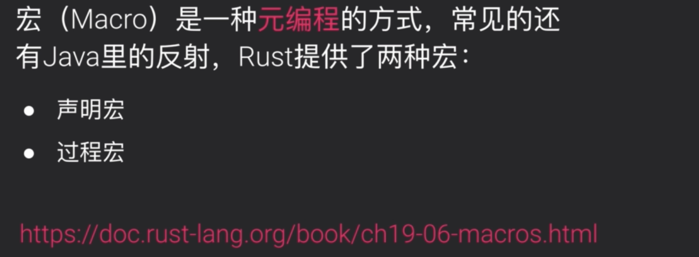

## 5.Rust进阶（续）



宏是一种元编程，并不是Rust特有的。Java中的反射也是一种元编程。


DSL是否会给初学者造成一些负担呢？最开始看的话是这个样子，但是如果没有这套DSL，可能需要你自己去实现很多底层的东西，反倒是容易让开发者直接放弃。

通过这套DSL使得开发者不用再去关注底层的实现（比如数据库，P2P，密码学等），只需要开发者实现自己的业务逻辑即可。


runtime即状态转换函数，由交易触发。


这样你的开发过程就像是在作画，每个pallet就是你的作画工具。

常用pallets：

- 资产相关：assets和balances
- 共识相关：babe和grandpa
- 治理相关：collective和democracy


**decl_storage**


例子：


首先定义了一个trait Trait。该trait是继承自system::Trait。其内部定义了一个关联类型Event，该类型有两个约束：1. 可以从模块内部的Event转换成这里面的关联类型Event；2.可以变成system模块中的Event。

decl_storage!宏中定义了该pallet存储的数据结构。TemplateModule是给出的一个名称，用于和其他模块进行隔离。其中定义了一个存储单元Something，其类型是`Option<u32>`。这里还定义了一个可选的get函数something（通过fn+函数名定义函数）。

注：除了定义`Option<u32>`这样的单值类型外，还可以定义映射类型和双键映射类型，后面会去介绍。

**decl_module**


交易在substrate中也被称作extrinsic。这些交易能被实现，是因为同时定义了对应的可调用函数。

例子：


在decl_module宏中，定义了一个结构体Module，以及一个enum Call并给出了一个类型的约束origin。该约束origin的类型是由Module的泛型T提供的Origin约束。这是因为T本身绑定的Trait约束中并不包含Origin约束，但是其是继承自system::Trait，所以Origin约束的类型也是来自于system模块。

如果我们在可调用函数中使用到错误信息的话，我们需要对错误类型进行绑定：`type Error = Error<T>;`

如果可调用函数里需要触发事件的话，需要去填写这样一个函数声明：`fn deposit_event() = default;`

真正的可调用函数逻辑是在`pub fn do_something`被定义。其上面的`#[weight = 10_00]`是用来表示可调用函数的权重，具体权重的定义会在后面的课程中介绍。

do_something函数包含两个参数：1.上述的约束类型origin，即`T::Origin`；2.something，其类型为u32。

所有的调用函数的返回结果都是一个DispatchResult类型。DispatchResult其实是Rust中的Result的一个类型别名：

```rust
pub type DispatchResult = Result<(), sp_runtime::DispatchError>;
```

如果是Error则返回DispatchError类型的错误，如果是Ok则返回空tuple`()`。

看一下业务逻辑：

```rust
			// 将something的值存入存储单元Something中
			Something::put(something);

			// 触发SomethingStored这样一个事件
			Self::deposit_event(RawEvent::SomethingStored(something, who));
			// Return a successful DispatchResult
			Ok(())
```

下面来看一下另一个可调用函数的例子：


具体逻辑：

```rust
		/// An example dispatchable that may throw a custom error.
		#[weight = 10_000]
		pub fn cause_error(origin) -> dispatch::DispatchResult {
			// -- snip --

			// 通过get函数来获取存储单元Something中的值
			match Something::get() {
				// 如果存储单元返回值为None，返回Error的类型为自定义（在decl_error宏中定义 ）的Error类型NoneValue
				None => Err(Error::<T>::NoneValue)?,
        // 入错存储单元中有值，值存储在old中
				Some(old) => {
					// 对old进行安全的+1操作。如果检查出现异常，则返回自定义的StorageOverflow类型的Error
          // 注：?在Rust中表示对Result类型解包，如果是Error直接返回，如果不是Error则取出其中Ok包裹的值
					let new = old.checked_add(1).ok_or(Error::<T>::StorageOverflow)?;
					// 将new报错到Something的存储单元中
					Something::put(new);
					Ok(())
				},
			}
		}
```

**保留函数**


on_initialize：会在每个区块的开头执行，比如在每个区块中检查定时器队列中有无待执行的任务。如果有的话会首先去执行

on_finalize：同上，但是是区块结束时执行

offchain_worker：链外工作机，用来执行计算复杂度较高或需要与外部数据源交互的使用场景。比如你的区块链需要通过http请求获取链外数据的时候就会使用到offchain worker。他的好处是不会占用链上计算资源和存储资源。

**decl_event**


只有等区块打包交易时才会真正调用用户发的交易对应的可调函数。substrate通过触发事件来告诉外界该交易是执行成功还是失败了。前端有订阅事件或监控状态的API。

```rust
decl_event!(
  // 定义了一个event，并且给出了一个约束AccountId，该约束是来源于frame_system::Trait::AccountId
	pub enum Event<T> where AccountId = <T as frame_system::Trait>::AccountId {
		// 事件名：SomethingStored
		SomethingStored(u32, AccountId),
	}
);
```

在可调用函数中通过deposit_event这个函数来触发event：

```rust
	Self::deposit_event(RawEvent::SomethingStored(something, who));
```

**decl_error**

```rust
decl_error! {
  // 定义了Error的枚举类型，for Module<T: Trait>表示该Error是针对本module的
	pub enum Error for Module<T: Trait> {
		// 索引是0，第一种错误类型
		NoneValue,
		// 索引是1，第二种错误类型
		StorageOverflow,
	}
}
```

以上定义的错误类型可以在可调用函数中使用，但是要注意：


1. event里面是可以添加自定义的信息的，而Error不能；
2. metadata是substrate runtime中的一些特征，用来告知客户端该runtime提供哪些功能/提供哪些可调用函数/有哪些错误/会触发哪些事件这样的信息；
3. system.ExtrinsicFailed包含对应错误的信息其实就是是decl_error!宏中定义错误的索引。

**construct_runtime**


通过前面几个宏定义好了runtime的pallet之后，就可以将该pallet加载到runtime里面。加载之前要先实现模块的配置接口：

```rust
// 位于runtime/src/lib.rs文件

/// Configure the template pallet in pallets/template.是Runtime实现我们template中的自定义的Trait约束
impl pallet_template::Trait for Runtime {
  // 只有一个Event类型的约束
	type Event = Event;
}

// 通过宏construct_runtime!，使用前面配置的FRAME pallets创建Runtime
construct_runtime!(
  // 定义了一个公有的Runtime枚举，并且绑定了许多类型约束：Block/NodeBlock/UncheckedExtrinsic
	pub enum Runtime where
		Block = Block,
		NodeBlock = opaque::Block,
		UncheckedExtrinsic = UncheckedExtrinsic
	{	
    // 其他预制的pallet的引入
		System: frame_system::{Module, Call, Config, Storage, Event<T>},
		RandomnessCollectiveFlip: pallet_randomness_collective_flip::{Module, Call, Storage},
		Timestamp: pallet_timestamp::{Module, Call, Storage, Inherent},
		Aura: pallet_aura::{Module, Config<T>, Inherent},
		Grandpa: pallet_grandpa::{Module, Call, Storage, Config, Event},
		Balances: pallet_balances::{Module, Call, Storage, Config<T>, Event<T>},
		TransactionPayment: pallet_transaction_payment::{Module, Storage},
		Sudo: pallet_sudo::{Module, Call, Config<T>, Storage, Event<T>},
		// 引入我们自定义的pallet，这里需要显式引入一些该pallet的资源，比如Module/Call/Storage/Event<T>。这里没有引入Error，其实也可以引入它。
		TemplateModule: pallet_template::{Module, Call, Storage, Event<T>},
	}
);
```

注：这里的引入顺序是有关系的。如果你自定义的pallet依赖了其他pallet，那么需要将你的TemplateModule放在该模块的后面。

**cargo expand**


当然，展开后的代码可读性也并不是那么好。


当我们需要实现新的runtime api时，可以使用宏decl_runtime_apis或imp_runtime_apis。

decl_runtime_apis宏：将runtime中的一些函数或数据通过api的形式暴露给客户端去使用。

当runtime中需要调用Host对应的函数时，我们需要runtime_interface。那什么是Host呢？我们已经有了runtime的逻辑，整个substrate体系中分成了runtime和Host。可以将sustrate想象成一个蒸蛋，蛋黄是runtime，外面的蛋白是Host。