## 6. 开发存证区块链

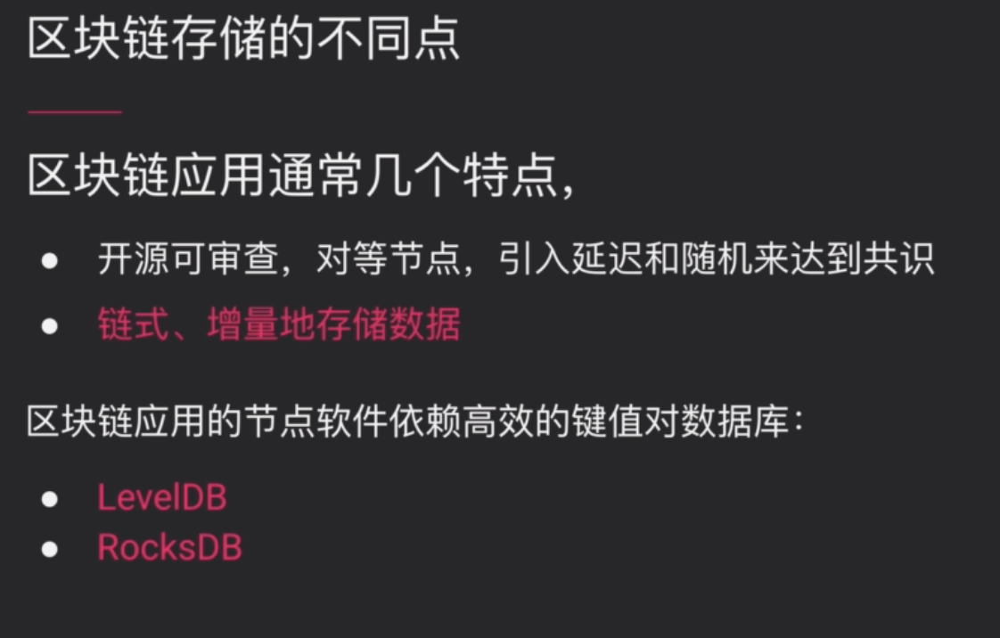

数据库选型方面：比特币和以太坊客户端选择LevelDB，parity ethereum和substrate依赖的是RocksDB。

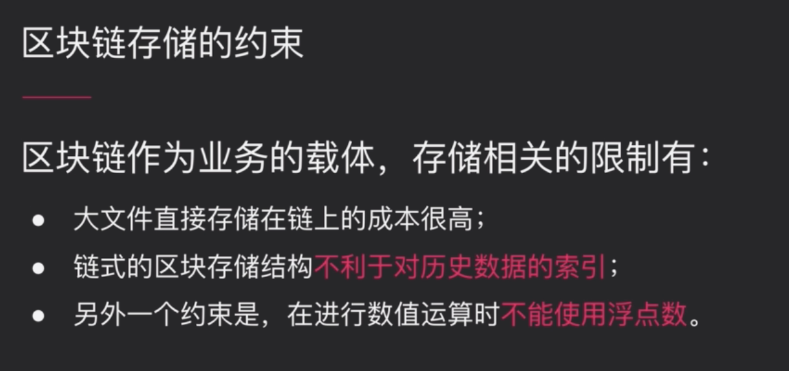

浮点数的舍入、计算、比较，由于编译器的优化程度不同、计算机架构不同，导致结果不同。这是区块链共识中不允许的。

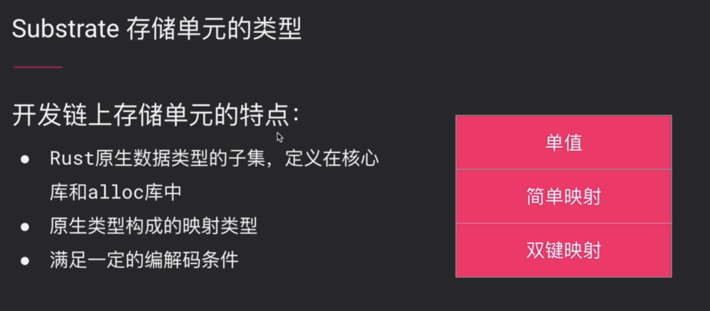

substrate为开发者提供了丰富的数据类型用于存储。通常把subsrate支持存储数据类型分为三种：

- 单值：数值、bool、枚举、结构体
- 简单映射：map
- 双键映射：double map，即两个key对应一个value

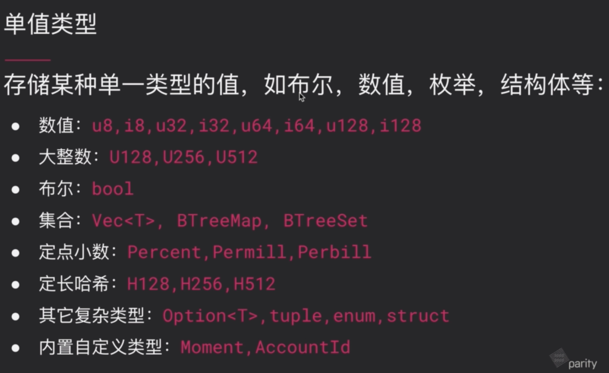

之前说过不能使用浮点数，那么在substrate中的浮点数使用Percent/Permill/Perbill类型。

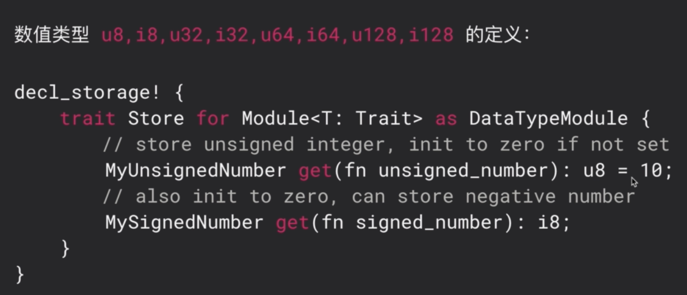

MyUnsignedNumber的默认值是10，MySignedNumber的默认值是0（由于没有手动定义）。

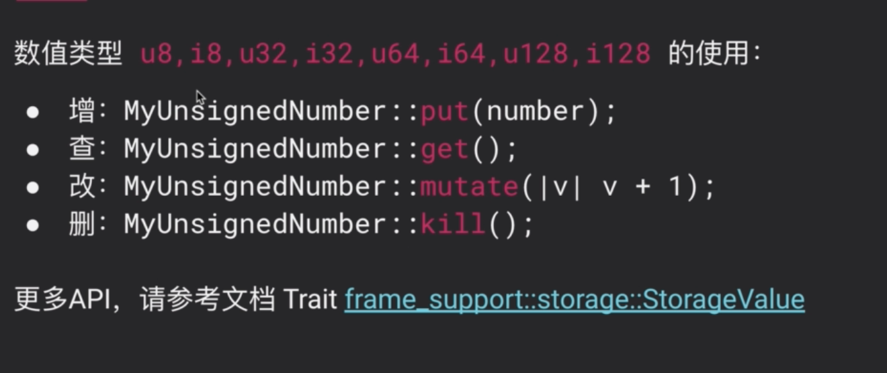

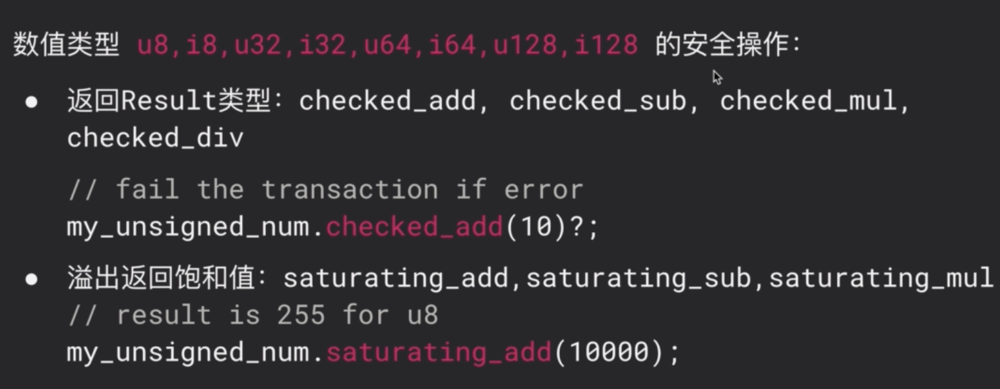

上述安全操作实际上是rust的标准语法。checked_xxx函数在计算时会进行校验，如果发生了溢出或者其他错误，将返回Error。

溢出返回饱和值为：当计算发生溢出时，返回饱和值（u8类型的饱和值为255）。使用saturating_add()方法。

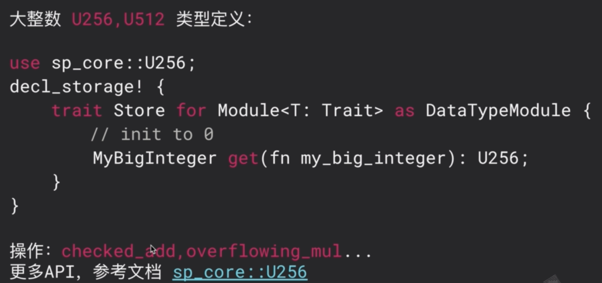

如果需要比u128更大的整数，则使用大整数。在使用前需要导入`use sp_core::U256`。大整数的默认值也是0。

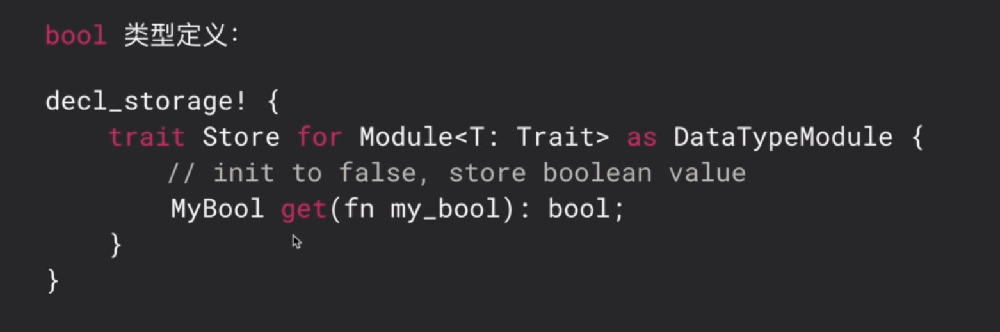

布尔值就很简单，默认值为false。

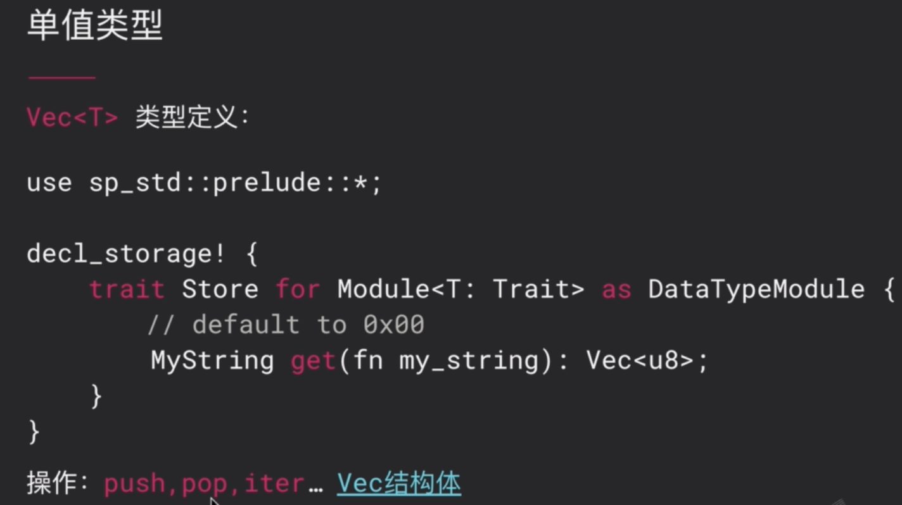

使用`Vec<T>`需要实现导入`use sp_std::prelude::*;`

因为substrate的runtime不支持rust的标准库，所以也不支持String类型。如果需要表示字符串，那么就使用`Vec<u8>`来替代进行编码和存储。

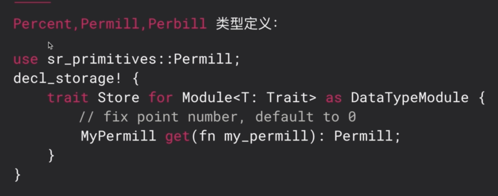

定点小数：Percent百分之几，Permill百万分之几，Perbill十亿分之几。

首先也是要引入类型定义：`use sr_primitives::Permill;`

如何去构造一个Permill这样的数据对象呢？有三个API：

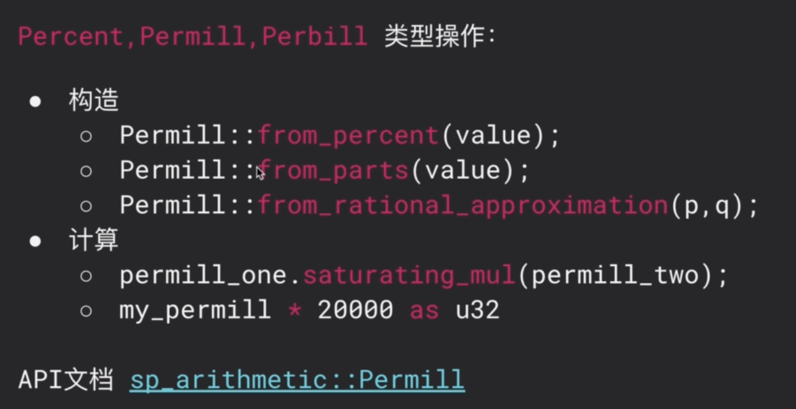

Permill::from_parts(value)：value为分子数（分母隐式为100w）；

Permill::from_rational_approximation(p,q)：手动指定分子p和分母q来构造；

计算：

- 安全：saturating_mul(xxx)；
- 非安全的：my_permill * 20000 as u32；

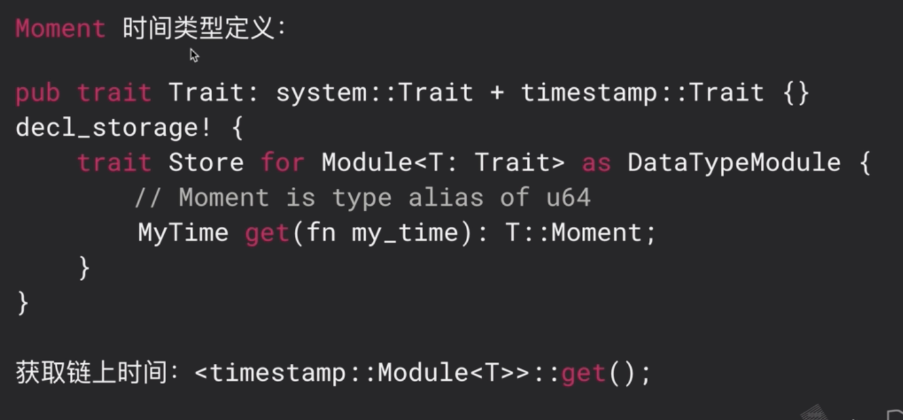

时间类型是定义在timestamp的配置接口里面，所以在定义本pallet的Trait时要使其继承于timestamp::Trait。

因为pallet的Trait中并没有定义一个Moment类型，所以decl_storage宏中MyTime的get函数的返回值为T::Moment，它是来自于timestamp的Trait。

timestamp为substrate预制好的一个pallet。

获取链上时间的方法：`<timestamp::Module<T>>::get();`，获取到之后就可以存入我们decl_storage宏定义的自定义存储项MyTime里面。

如何去操作用户的账户信息呢？使用到了AccountId这样的数据类型。

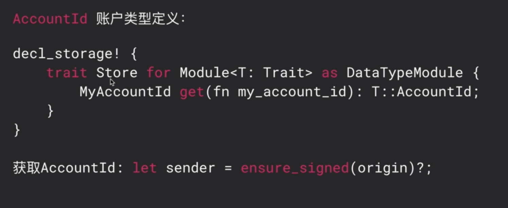

MyAccount数据项的数据类型为`T::AccountId`，由于本Trait下没有定义AccountId类型，那么`T::AccountId`实际上是来源于system pallet里的。

通过system pallet提供的ensure_signed帮助方法，并传入可调用函数的第一个参数origin来获取交易发送者的AccountId。

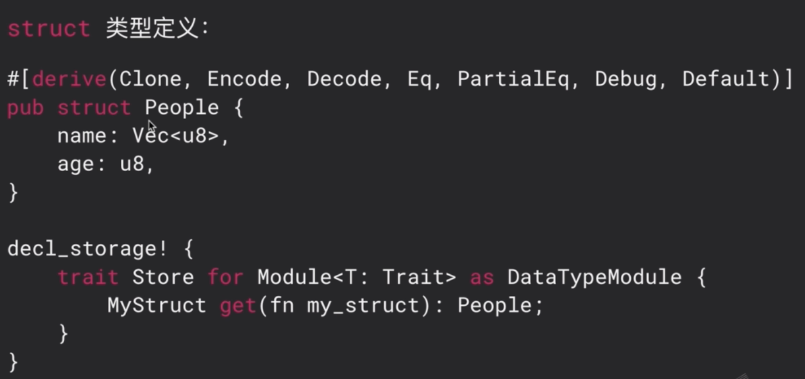

自定义struct，可以derive。

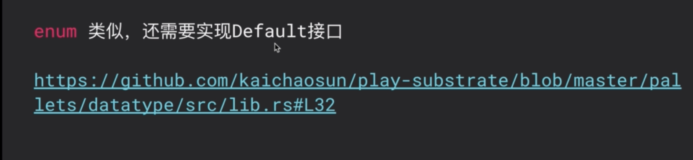

enum类型与struct类似，不同的是enum需要手动实现Default接口，而不能像struct那样使用derive来实现。

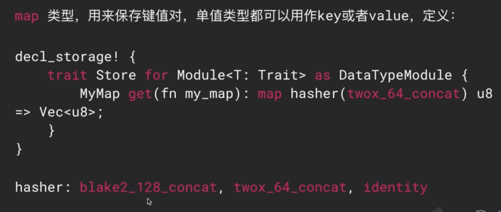

MyMap数据类型：`u8=>Vec<u8>`，即key是`u8`，value是`Vec<u8>`。

需要注意的是：在声明MyMap的具体类型时，需要显式声明一个hash函数：`hasher(twox_64_concat)`。该哈希函数会被用作生成tree path，进一步可以生成底层需要的merkle patricia tree。

除了twox_64以外，substrate还提供另外两种哈希函数blake2_128和identity。blake2_128是一种加密安全的哈希算法，当输入源不可信的时候（比如输入源是由用户控制的），通常我们需要blake2_128。如果输入源可信时（比如一些自踪有界的index），我们可以使用非加密安全的twox_64。如果输入本身就是一个加密安全的哈希输出结果的时候，我们可以使用identity，从而避免二次hash。

注：blake2_128要比twox_64的计算效率低。

下面来看一下map的操作方法：

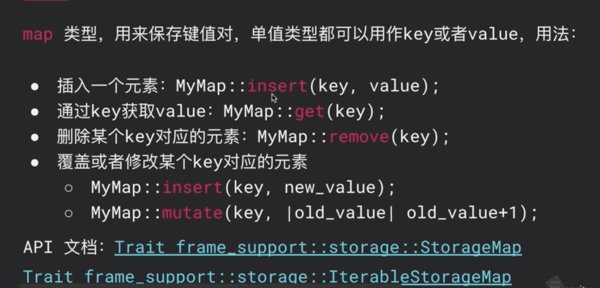

insert方法还可以覆盖原有value，而mutate是修改原有value（可手动指定修改逻辑）。

由于map还实现了IterableStorageMap的接口，也就是说map本身是可以被遍历的。具体使用方法可以去图中的api文档中自行查看。


上图demo中，double_map的key1是T::AccountId，key2是u32，value是`Vec<u8>`。同时也分别指定了对于key1和key2使用的哈希函数。

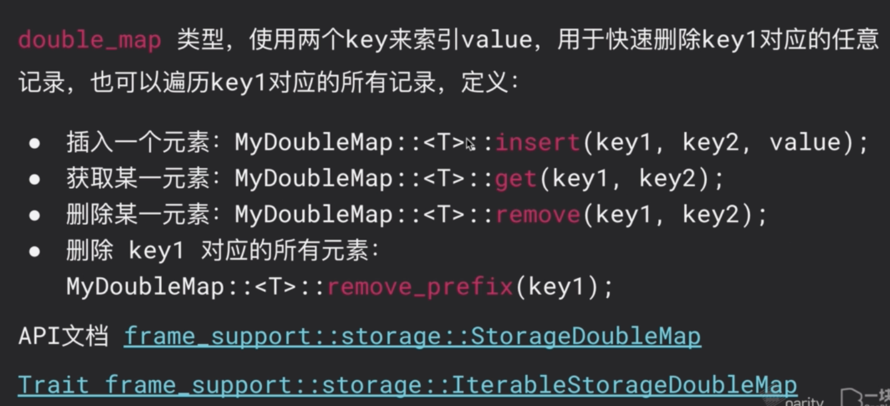

可以删除key1为前缀的所有元素，即所有key1值相同的kv对，无论其key2是否一样。

double_map也同样支持遍历操作。

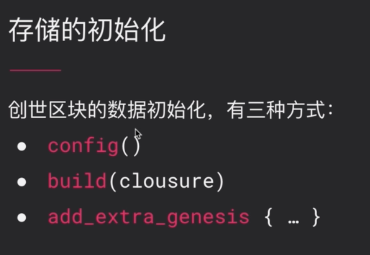

substrate中常用的数据初始化方式有如上说的三种，接着来看个demo：

```rust
// 来源于：https://github.com/kaichaosun/play-substrate/blob/master/pallets/genesis-config/src/lib.rs
#![cfg_attr(not(feature = "std"), no_std)]

use frame_support::{decl_module, decl_storage, decl_event, decl_error, dispatch};
use frame_system::ensure_signed;

pub trait Trait: frame_system::Trait {
	type Event: From<Event<Self>> + Into<<Self as frame_system::Trait>::Event>;
}

// 定义三个存储项
decl_storage! {
	trait Store for Module<T: Trait> as GenesisConfigModule {
		// 第一个存储单元是Something，其类型为Option<u32>，初始化方法是config()
		Something get(fn something) config(): Option<u32>;
	
    // 第二个存储单元是SomethingTwo，其类型也是Option<u32>，其利用build函数来构建SomethingTwo的初始值。它接受参数是一个closure——closure的参数是config。
		SomethingTwo get(fn something_two) build(|config: &GenesisConfig<T>| {
      // 传入参数的config的something_two成员的值+1，包成Some作为closure的返回值。这个config参数的类型具体是什么，后面再看
			Some(config.something_two + 1)
		}): Option<u32>;

    // 第三个存储单元就是一个T::AccountId => u32的map，对于该存储项的初始化是通过下面的add_extra_genesis进行的
		SomethingMap get(fn something_map): map hasher(blake2_128_concat) T::AccountId => u32;
	}
	
  // 注：无论是使用build还是add_extra_genesis进行初始化，如果你用到了一些初始化数据，我们需要在add_extra_genesis这里进行注册
	add_extra_genesis {
    // 由于在SomethingTwo的初始化build函数的closure里使用了config.something_two，所以在这注册
		config(something_two): u32;
    // 注册some_account_value类型，下面的build中有使用
		config(some_account_value): Vec<(T::AccountId, u32)>;
    
    // 同时在add_extra_genesis中也会有一个build函数，该函数的closure中使用了config.some_account_value.iter()，所以在上面注册了some_account_value类型
    // 该build的closure也是接受一个初始化配置类型参数config
		build(|config: &GenesisConfig<T>| {
      // 对config.some_account_value进行迭代，迭代出的元素是个tuple
			for (who, value) in config.some_account_value.iter() {
        // 更新至存储项SomethingMap里面
				SomethingMap::<T>::insert(who, value);
			}
		})
	}	
}
...
}
```

下面来看看上面所谓的config是怎么获得的：在node/src/chain_spec.rs文件中

```rust
...

/// Configure initial storage state for FRAME modules.
fn testnet_genesis(
	wasm_binary: &[u8],
	initial_authorities: Vec<(AuraId, GrandpaId)>,
	root_key: AccountId,
	endowed_accounts: Vec<AccountId>,
	_enable_println: bool,
) -> GenesisConfig {
	GenesisConfig {
		...
    // 这里可见GenesisConfig的初始化结构体
		pallet_genesis_config: Some(GenesisConfigModuleConfig {
      // 上面定义存储项初始化依赖的三个数值如下：
			something: 9,
			something_two: 10,
      // 这里的some_account_value相对复杂些，从一系列的accounts——endowed_accounts 调用map方法成一个tuple的集合。tuple就是下面的(k,2)，第一个元素就是AccountId，第二个元素是2。
			some_account_value: endowed_accounts.iter().cloned().map(|k|(k, 2)).collect(),
		})
	}
}
```

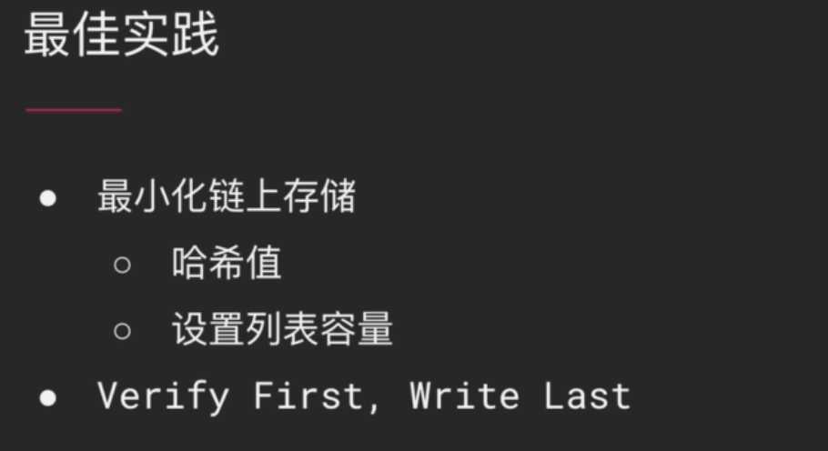

区块链在每个节点上都有副本，那么其数据存储是非常昂贵的。所以在做存储设计时要做到最小化存储空间。有两种方式：

1. 对于大文件只记录哈希值；
2. 存储集合类型时，要设置其容量。

在修改链上数据状态之前，要事先做好检查，遵循Verify First，Write Last原则。

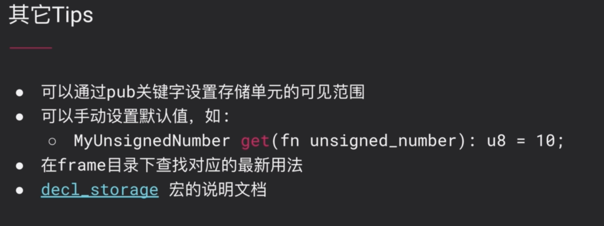

其实所有的存储单元对用户来说都是可见的，而在这里使用pub关键字设置存储单元的可见范围是针对于runtime里面其他的模块而言的。

由于substrate还是快速迭代当中，所以很多语法很快就会过时。可以在substrate工程的frame目录下找到对应pallet的最新用法：

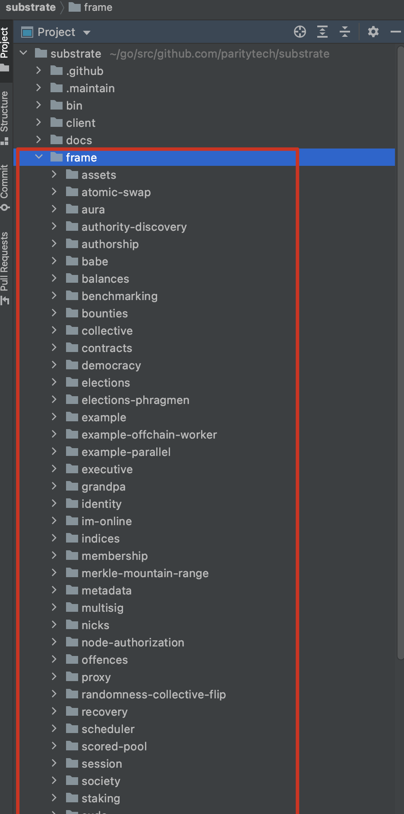

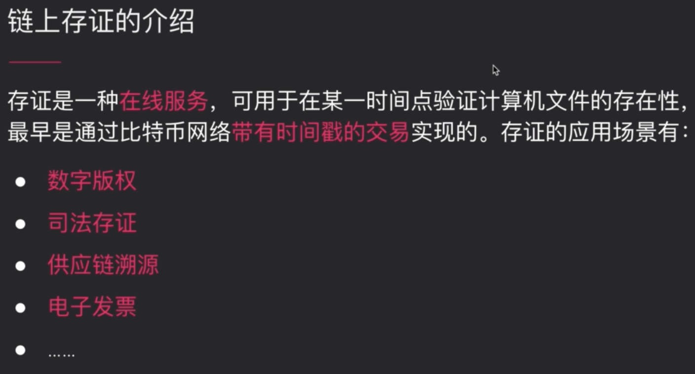

环境：

1. substrate-node-template：commit为8f769db，如果之前没有git clone过则：

```shell
git clone -b v2.0.0-rc5 --depth 1 https//github.com/substrate-developer-hub/substrate-node-template
```

-b表示指定分支名，--depth 1表示只克隆少部分历史以减少下载量。

2. substrate-front-end-template：commit为61fd0a6

开始写代码：

1.pallets下整体复制template文件夹，并重命名为poe


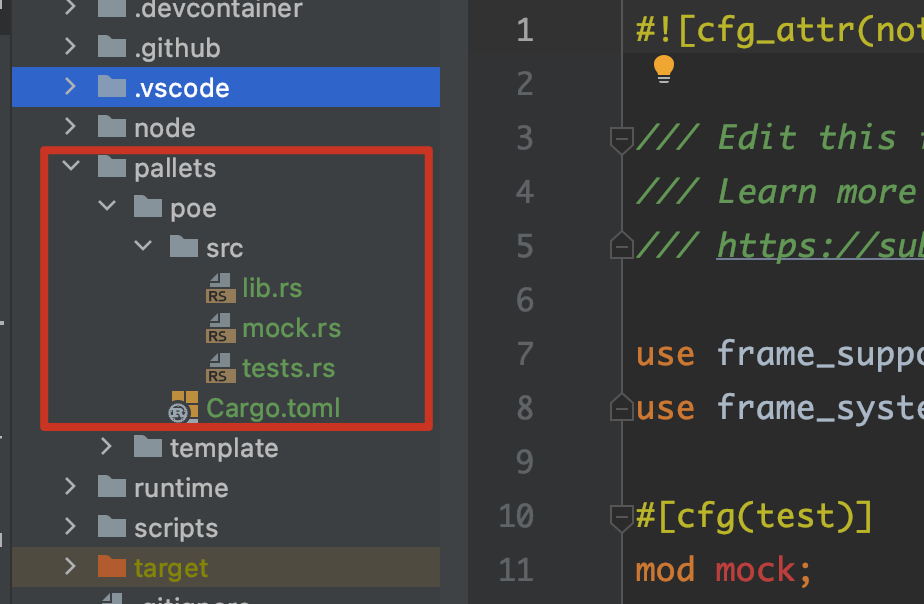

修改其中的Cargo.toml：

```toml
# 表示在编译生成文档时，指定了我们的平台是x86_64-linux。也就是它不需要再向其他的平台进行编译，可以减少文档占用磁盘的容量
[package.metadata.docs.rs]
targets = ['x86_64-unknown-linux-gnu']

# 项目里面依赖的工具包
# 编解码相关的codec
[dependencies.codec]
default-features = false
features = ['derive']
package = 'parity-scale-codec'
version = '1.3.1'

# frame-support提供了runtime所用到的宏（decl_storage/decl_module等）和一些数据类型（map/double_map等）
[dependencies.frame-support]
default-features = false
git = 'https://github.com/paritytech/substrate.git'
tag = 'v2.0.0-rc5'
version = '2.0.0-rc5'

# frame-system是所有runtime的pallet都需要依赖的一个基础模块，提供了一些核心类型和基本组件
[dependencies.frame-system]
default-features = false
git = 'https://github.com/paritytech/substrate.git'
tag = 'v2.0.0-rc5'
version = '2.0.0-rc5'

# sp-core提供了一些共享的基础类型
[dev-dependencies.sp-core]
default-features = false
git = 'https://github.com/paritytech/substrate.git'
tag = 'v2.0.0-rc5'
version = '2.0.0-rc5'

# sp-io提供了一些读写所具有的基本功能
[dev-dependencies.sp-io]
default-features = false
git = 'https://github.com/paritytech/substrate.git'
tag = 'v2.0.0-rc5'
version = '2.0.0-rc5'

# sp-runtime提供了通用的runtime模块所有到的类型都会在这里面进行定义
[dev-dependencies.sp-runtime]
default-features = false
git = 'https://github.com/paritytech/substrate.git'
tag = 'v2.0.0-rc5'
version = '2.0.0-rc5'

# features用于条件编译，默认是std模式。
[features]
default = ['std']
# 这里要保证下面依赖的包都是支持std模式编译的
std = [
    'codec/std',
    'frame-support/std',
    'frame-system/std',
]
```

注：依赖有两种。线上环境的依赖是dependencies表示，例如：`[dependencies.frame-system]`；测试所依赖的工具包用dev-dependencies表示，例如：`[dev-dependencies.sp-io]`。

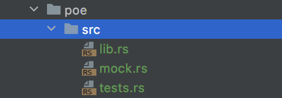

src路径下是源代码文件。lib.rs为pallet源代码文件，mock.rs为测试依赖文件，tests.rs为测试用例文件。

目前我们还不用写测试，所以删除test.rs中的代码，以免产生编译错误。

看一下lib.rs文件中的decl_module!：

```rust
decl_module! {
	pub struct Module<T: Trait> for enum Call where origin: T::Origin {
    // 如果要在调用函数中使用到自定义的Error，则需要在这里进行类型绑定
		type Error = Error<T>;

		// 如果在调用函数中可以触发事件，在这里需要这行
		fn deposit_event() = default;
    // 注：上面这两行不是rust的标准语法，而是在decl_module宏中做了一些黑魔法
    ...
	}
}
```

对lib.rs中之前余留的代码进行删除：

```rust
#![cfg_attr(not(feature = "std"), no_std)]

use frame_support::{decl_module, decl_storage, decl_event, decl_error, dispatch, traits::Get};
use frame_system::ensure_signed;

#[cfg(test)]
mod mock;

#[cfg(test)]
mod tests;

/// Configure the pallet by specifying the parameters and types on which it depends.
pub trait Trait: frame_system::Trait {
    /// Because this pallet emits events, it depends on the runtime's definition of an event.
    type Event: From<Event<Self>> + Into<<Self as frame_system::Trait>::Event>;
}

decl_storage! {
	trait Store for Module<T: Trait> as TemplateModule {
			// 清空
	}
}

decl_event!(
	pub enum Event<T> where AccountId = <T as frame_system::Trait>::AccountId {
    // 清空
	}
);

decl_error! {
	pub enum Error for Module<T: Trait> {
    // 清空
	}
}

decl_module! {
	pub struct Module<T: Trait> for enum Call where origin: T::Origin {
		type Error = Error<T>;
		fn deposit_event() = default;
    
    // 清空
	}
}
```

先来写存储单元宏:

```rust
use sp_std::prelude::*;

decl_storage! {
	trait Store for Module<T: Trait> as TemplateModule {
    		// 定义存储项Proofs。可见AccountId和BlockNumber均来自于T。T满足本模块定义Trait。但是由于本模块的Trait定义中并没有这两个数据类型。
        Proofs get(fn proofs):map hasher(blake2_128_concat) Vec<u8>=> (T::AccountId,T::BlockNumber);
    		// 注：这里由于使用了Vec，所以要在文件开头引入依赖 use sp_std
	}
}

// 由于Trait定义中并没有AccountId和BlockNumber的类型声明，所以可知这两种数据类型应该是在frame_system::Trait中定义的
pub trait Trait: frame_system::Trait {
    type Event: From<Event<Self>> + Into<<Self as frame_system::Trait>::Event>;
}
```

由于poe/src/lib.rs中引入`use sp_std::prelude::*;`，所以需要在poe/Cargo.toml中引入依赖：

```toml
# 由于是生产代码中的依赖，所以是dependencies
[dependencies.sp-std]
default-features = false
git = 'https://github.com/paritytech/substrate.git'
tag = 'v2.0.0-rc5'
version = '2.0.0-rc5'

# 同时别忘了在features中假如std的编译标签
[features]
default = ['std']
std = [
    'codec/std',
    'frame-support/std',
    'frame-system/std',
    # 加入
    'sp-std/std,'
]
```

接下来在decl_module!中编写创建存证的可调用函数：

```rust
decl_module! {
	pub struct Module<T: Trait> for enum Call where origin: T::Origin {
		type Error = Error<T>;
		fn deposit_event() = default;

    // 交易的权重表示交易执行的时间，这里不做讨论
		#[weight=0]
		// origin由系统提供，claim为我们要存证的哈希值
		pub fn create_claim(origin,claim:Vec<u8>)->dispatch::DispatchResult{
            // 交易验签并获取accountId
            let sender = ensure_signed(origin)?;
            // 检查该传入的哈希值是否已经存在于存储单元内,如果已存在返回错误ProofAlreadyExist
            ensure!(!Proofs::<T>::contains_key(&claim),Error::<T>::ProofAlreadyExist);
            // 注：在使用Proofs的contains_key方法时，增添了泛型声明<T>。这是因为在定义结构Proofs时使用到了泛型T来声明map的value：(T::AccountId,T::BlockNumber)
            // 同理Error也是。
            // 同时需要在frame_support中引入ensure宏，并在decl_error中定义ProofAlreadyExist错误

            // 保存存储单元，key为claim，value为(T::AccountId,T::BlockNumber)
            Proof::<T>::insert(&claim,(sender.clone(),frame_system::Module::<T>::block_number()));
            // 这里T::AccountId实现类为sender.clone()，T::BlockNumber的实现类为frame_system::Module::<T>::block_number()

            // 触发事件，携带两个参数：交易的发送方和claim哈希值
            Self::deposit_event(RawEvent::ClaimCreated(sender,claim));  // 需要在decl_event!中定义对应的Event类型
            // 返回Ok(())
            Ok(())
		}
		
		...
	}
}
```

看一下该过程中需要添加其他依赖类型：

```rust
decl_event!(
	pub enum Event<T> where AccountId = <T as frame_system::Trait>::AccountId {
	    ClaimCreated(AccountId,Vec<u8>);
	}
);

decl_error! {
	pub enum Error for Module<T: Trait> {
	    ProofAlreadyExist
	}
}
```

继续看一下消除存证的可调用函数逻辑编写：

```rust
decl_module! {
	pub struct Module<T: Trait> for enum Call where origin: T::Origin {
		type Error = Error<T>;
		fn deposit_event() = default;

    ...

		// 看一下删除存证的功能
		#[weight=0]
		pub fn revoke_claim(origin,claim:Vec<u8>) -> dispatch::DispatchResult{
            let sender = ensure_signed(origin)?;
            // 检查该claim哈希存在于数据项存储中。注意：去定义Error:ClaimNotExist
            ensure!(Proofs::<T>::contains_key(&claim),Error::<T>::ClaimNotExist);

            // 获取当前claim对应的value
            let (owner,_block_number) = Proofs::<T>::get(&claim);

            // 校验发送方是否是claim的owner，如果不是则发送错误NotClaimOwner。注意：去定义Error:NotClaimOwner
            ensure!(owner == sender, Error::<T>::NotClaimOwner);

            // 通过以上所有的校验后，从store中删除claim——通过key来删除对应kv对
            Proofs::<T>::remove(&claim);

            // 触发事件
            Self::deposit_event(RawEvent::ClaimRevoked(sender,claim));  // 需要在decl_event!中定义对应的Event类型
            Ok(())
		}
	}
}
```

去decl_event和decl_error中补齐：

```rust
decl_event!(
	pub enum Event<T> where AccountId = <T as frame_system::Trait>::AccountId {
	    ClaimCreated(AccountId,Vec<u8>);
	    ClaimRevoked(AccountId,Vec<u8>);
	}
);

decl_error! {
	pub enum Error for Module<T: Trait> {
	    ProofAlreadyExist,
	    ClaimNotExist,
	    NotClaimOwner,
	}
}
```

将我们编写的poe pallet注册进runtime，改写runtime/Cargo.toml

```toml
# 添加
[dependencies.poe]
default-features = false
pacakge = 'pallet-poe'
path = '../pallets/poe'
version = '2.0.0-rc5'

# 同时添加poe的std编译标签
[features]
default = ['std']
std = [
    'aura/std',
    'balances/std',
    'codec/std',
    'frame-executive/std',
    'frame-support/std',
    'grandpa/std',
    'randomness-collective-flip/std',
    'serde',
    'sp-api/std',
    'sp-block-builder/std',
    'sp-consensus-aura/std',
    'sp-core/std',
    'sp-inherents/std',
    'sp-offchain/std',
    'sp-runtime/std',
    'sp-session/std',
    'sp-std/std',
    'sp-transaction-pool/std',
    'sp-version/std',
    'sudo/std',
    'system/std',
    'timestamp/std',
    'transaction-payment/std',
    'template/std',
    # 增添。注：此处的poe要与上面添加依赖的[dependencies.poe]中dependencies.后的名称一致
    'poe/std',
]
```

接着在runtime/src/lib.rs中添加poe模块的接口实现：

```rust
// 新增
impl poe::Trait for Runtime {
    // 类型绑定
    // type Event表示poe::Trait中使用的Event（即poe模块中的定义的Event）
    // 等号后的Event是由construct_runtime!生成的Event，是Runtime使用的总的Event的类型，并且可以转换成poe模块中使用的Event
    type Event = Event;
}
```

在construct_runtime!中加载poe模块：

```rust
construct_runtime!(
	pub enum Runtime where
		Block = Block,
		NodeBlock = opaque::Block,
		UncheckedExtrinsic = UncheckedExtrinsic
	{
		System: system::{Module, Call, Config, Storage, Event<T>},
		RandomnessCollectiveFlip: randomness_collective_flip::{Module, Call, Storage},
		Timestamp: timestamp::{Module, Call, Storage, Inherent},
		Aura: aura::{Module, Config<T>, Inherent},
		Grandpa: grandpa::{Module, Call, Storage, Config, Event},
		Balances: balances::{Module, Call, Storage, Config<T>, Event<T>},
		TransactionPayment: transaction_payment::{Module, Storage},
		Sudo: sudo::{Module, Call, Config<T>, Storage, Event<T>},
		TemplateModule: template::{Module, Call, Storage, Event<T>},
    // 加入poe module
    // Call表示可调函数，Storage表示存储单元
		PoeModule: poe::{Module, Call, Storage, Event<T>},
	}
);
```

到此就完成了poe模块的编写，下面进行编译：

```shell
# 先cd到工程的根路径下
cargo build --release
```

