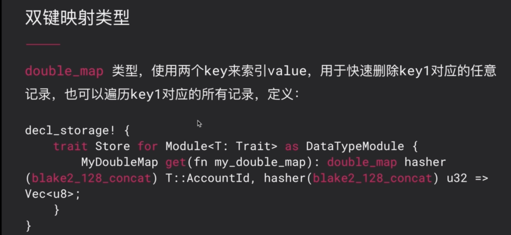

## 6. 开发存证区块链


数据库选型方面：比特币和以太坊客户端选择LevelDB，parity ethereum和substrate依赖的是RocksDB。


浮点数的舍入、计算、比较，由于编译器的优化程度不同、计算机架构不同，导致结果不同。这是区块链共识中不允许的。


substrate为开发者提供了丰富的数据类型用于存储。通常把subsrate支持存储数据类型分为三种：

- 单值：数值、bool、枚举、结构体
- 简单映射：map
- 双键映射：double map，即两个key对应一个value


之前说过不能使用浮点数，那么在substrate中的浮点数使用Percent/Permill/Perbill类型。


MyUnsignedNumber的默认值是10，MySignedNumber的默认值是0（由于没有手动定义）。


上述安全操作实际上是rust的标准语法。checked_xxx函数在计算时会进行校验，如果发生了溢出或者其他错误，将返回Error。

溢出返回饱和值为：当计算发生溢出时，返回饱和值（u8类型的饱和值为255）。使用saturating_add()方法。


如果需要比u128更大的整数，则使用大整数。在使用前需要导入`use sp_core::U256`。大整数的默认值也是0。


布尔值就很简单，默认值为false。


使用`Vec<T>`需要实现导入`use sp_std::prelude::*;`

因为substrate的runtime不支持rust的标准库，所以也不支持String类型。如果需要表示字符串，那么就使用`Vec<u8>`来替代进行编码和存储。


定点小数：Percent百分之几，Permill百万分之几，Perbill十亿分之几。

首先也是要引入类型定义：`use sr_primitives::Permill;`

如何去构造一个Permill这样的数据对象呢？有三个API：


Permill::from_parts(value)：value为分子数（分母隐式为100w）；

Permill::from_rational_approximation(p,q)：手动指定分子p和分母q来构造；

计算：

- 安全：saturating_mul(xxx)；
- 非安全的：my_permill * 20000 as u32；


时间类型是定义在timestamp的配置接口里面，所以在定义本pallet的Trait时要使其继承于timestamp::Trait。

因为pallet的Trait中并没有定义一个Moment类型，所以decl_storage宏中MyTime的get函数的返回值为T::Moment，它是来自于timestamp的Trait。

timestamp为substrate预制好的一个pallet。

获取链上时间的方法：`<timestamp::Module<T>>::get();`，获取到之后就可以存入我们decl_storage宏定义的自定义存储项MyTime里面。

如何去操作用户的账户信息呢？使用到了AccountId这样的数据类型。


MyAccount数据项的数据类型为`T::AccountId`，由于本Trait下没有定义AccountId类型，那么`T::AccountId`实际上是来源于system pallet里的。

通过system pallet提供的ensure_signed帮助方法，并传入可调用函数的第一个参数origin来获取交易发送者的AccountId。


自定义struct，可以derive。


enum类型与struct类似，不同的是enum需要手动实现Default接口，而不能像struct那样使用derive来实现。


MyMap数据类型：`u8=>Vec<u8>`，即key是`u8`，value是`Vec<u8>`。

需要注意的是：在声明MyMap的具体类型时，需要显式声明一个hash函数：`hasher(twox_64_concat)`。该哈希函数会被用作生成tree path，进一步可以生成底层需要的merkle patricia tree。

除了twox_64以外，substrate还提供另外两种哈希函数blake2_128和identity。blake2_128是一种加密安全的哈希算法，当输入源不可信的时候（比如输入源是由用户控制的），通常我们需要blake2_128。如果输入源可信时（比如一些自踪有界的index），我们可以使用非加密安全的twox_64。如果输入本身就是一个加密安全的哈希输出结果的时候，我们可以使用identity，从而避免二次hash。

注：blake2_128要比twox_64的计算效率低。

下面来看一下map的操作方法：


insert方法还可以覆盖原有value，而mutate是修改原有value（可手动指定修改逻辑）。

由于map还实现了IterableStorageMap的接口，也就是说map本身是可以被遍历的。具体使用方法可以去图中的api文档中自行查看。



上图demo中，double_map的key1是T::AccountId，key2是u32，value是`Vec<u8>`。同时也分别指定了对于key1和key2使用的哈希函数。


可以删除key1为前缀的所有元素，即所有key1值相同的kv对，无论其key2是否一样。

double_map也同样支持遍历操作。


substrate中常用的数据初始化方式有如上说的三种，接着来看个demo：

```rust
// 来源于：https://github.com/kaichaosun/play-substrate/blob/master/pallets/genesis-config/src/lib.rs
#![cfg_attr(not(feature = "std"), no_std)]

use frame_support::{decl_module, decl_storage, decl_event, decl_error, dispatch};
use frame_system::ensure_signed;

pub trait Trait: frame_system::Trait {
	type Event: From<Event<Self>> + Into<<Self as frame_system::Trait>::Event>;
}

// 定义三个存储项
decl_storage! {
	trait Store for Module<T: Trait> as GenesisConfigModule {
		// 第一个存储单元是Something，其类型为Option<u32>，初始化方法是config()
		Something get(fn something) config(): Option<u32>;
	
    // 第二个存储单元是SomethingTwo，其类型也是Option<u32>，其利用build函数来构建SomethingTwo的初始值。它接受参数是一个closure——closure的参数是config。
		SomethingTwo get(fn something_two) build(|config: &GenesisConfig<T>| {
      // 传入参数的config的something_two成员的值+1，包成Some作为closure的返回值。这个config参数的类型具体是什么，后面再看
			Some(config.something_two + 1)
		}): Option<u32>;

    // 第三个存储单元就是一个T::AccountId => u32的map，对于该存储项的初始化是通过下面的add_extra_genesis进行的
		SomethingMap get(fn something_map): map hasher(blake2_128_concat) T::AccountId => u32;
	}
	
  // 注：无论是使用build还是add_extra_genesis进行初始化，如果你用到了一些初始化数据，我们需要在add_extra_genesis这里进行注册
	add_extra_genesis {
    // 由于在SomethingTwo的初始化build函数的closure里使用了config.something_two，所以在这注册
		config(something_two): u32;
    // 注册some_account_value类型，下面的build中有使用
		config(some_account_value): Vec<(T::AccountId, u32)>;
    
    // 同时在add_extra_genesis中也会有一个build函数，该函数的closure中使用了config.some_account_value.iter()，所以在上面注册了some_account_value类型
    // 该build的closure也是接受一个初始化配置类型参数config
		build(|config: &GenesisConfig<T>| {
      // 对config.some_account_value进行迭代，迭代出的元素是个tuple
			for (who, value) in config.some_account_value.iter() {
        // 更新至存储项SomethingMap里面
				SomethingMap::<T>::insert(who, value);
			}
		})
	}	
}
...
}
```

下面来看看上面所谓的config是怎么获得的：在node/src/chain_spec.rs文件中

```rust
...

/// Configure initial storage state for FRAME modules.
fn testnet_genesis(
	wasm_binary: &[u8],
	initial_authorities: Vec<(AuraId, GrandpaId)>,
	root_key: AccountId,
	endowed_accounts: Vec<AccountId>,
	_enable_println: bool,
) -> GenesisConfig {
	GenesisConfig {
		...
    // 这里可见GenesisConfig的初始化结构体
		pallet_genesis_config: Some(GenesisConfigModuleConfig {
      // 上面定义存储项初始化依赖的三个数值如下：
			something: 9,
			something_two: 10,
      // 这里的some_account_value相对复杂些，从一系列的accounts——endowed_accounts 调用map方法成一个tuple的集合。tuple就是下面的(k,2)，第一个元素就是AccountId，第二个元素是2。
			some_account_value: endowed_accounts.iter().cloned().map(|k|(k, 2)).collect(),
		})
	}
}
```


区块链在每个节点上都有副本，那么其数据存储是非常昂贵的。所以在做存储设计时要做到最小化存储空间。有两种方式：

1. 对于大文件只记录哈希值；
2. 存储集合类型时，要设置其容量。

在修改链上数据状态之前，要事先做好检查，遵循Verify First，Write Last原则。


其实所有的存储单元对用户来说都是可见的，而在这里使用pub关键字设置存储单元的可见范围是针对于runtime里面其他的模块而言的。

由于substrate还是快速迭代当中，所以很多语法很快就会过时。可以在substrate工程的frame目录下找到对应pallet的最新用法：

