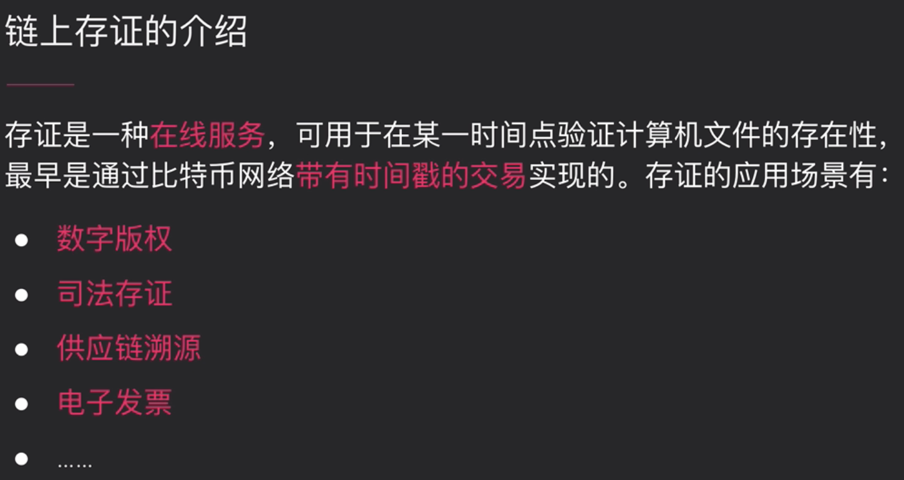
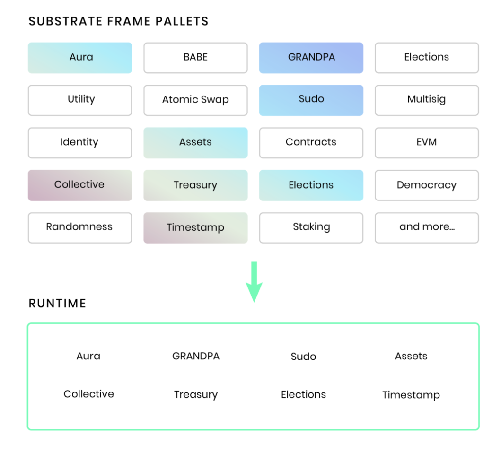
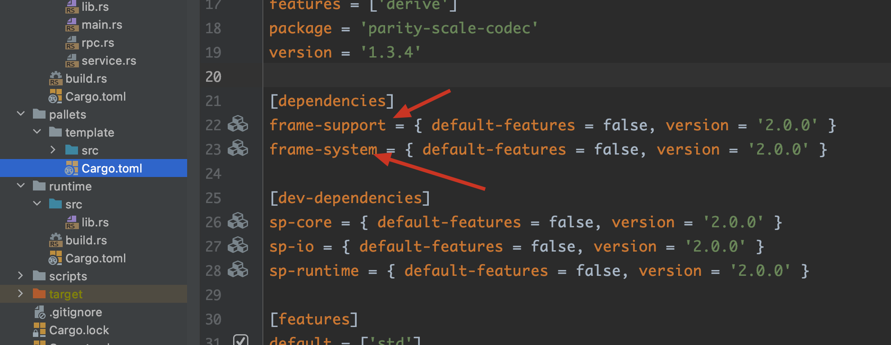

### 1 存证模块回顾和单元测试



官方文档教学：https://substrate.dev/docs/zh-CN/tutorials/build-a-dapp/

首先安装node template和front end template。

我们的Proof of Existence (PoE)将暴露两个可调函数：

- create_claim : 用户上传文件摘要
- revoke_claim：ownership的转移

FRAME是一个代码库，允许你自由组合pallets来创建自己的runtime。Substrate提供出了许多预制的pallets。



距离：FRAME中包含了一个`Balances`的pallet，该pallet用来控制区块链上基础货币，用来管理链上所有账户的余额。

如果你要让你的区块链支持智能合约，那么你的runtime里就要包含`Contracts`pallet。

如果想要链上治理，可以包含像`Democracy/Elections/Collective`这样的pallets。

这里我们要自定义开发一个pallet。打开一个node template工程:

```
substrate-node-template
|
+-- node
|
+-- pallets
|   |
|   +-- template
|       |
|       +-- Cargo.toml    <-- One change in this file
|       |
|       +-- src
|           |
|           +-- lib.rs     <-- Most changes in this file
|           |
|           +-- mock.rs
|           |
|           +-- tests.rs
|
+-- runtime
|
+-- scripts
|
+-- ...
```

这个模板中会有一些预写好的code，在开发中要删除并重写逻辑。

一个FRAME pallet可以分为一下六个部分：

```rust
// substrate-node-template/pallets/template/src/lib.rs中
// 1. Imports
use frame_support::{decl_module, decl_storage, decl_event, decl_error, dispatch};
use frame_system::ensure_signed;

// 2. Configuration
pub trait Trait: frame_system::Trait { /* --snip-- */ }

// 3. Storage
decl_storage! { /* --snip-- */ }

// 4. Events
decl_event! { /* --snip-- */ }

// 5. Errors
decl_error! { /* --snip-- */ }

// 6. Callable Functions
decl_module! { /* --snip-- */ }
```

**1.Imports and Dependencies**

```rust
use frame_support::{decl_module, decl_storage, decl_event, decl_error, dispatch};
use frame_system::ensure_signed;
```

由于pallets/template中的Cargo.toml依赖了frame-support和frame-system:



所以可以在template/src/lib.rs中直接使用`use frame_support::xxx`和`use frame_system::xxx`

当我们